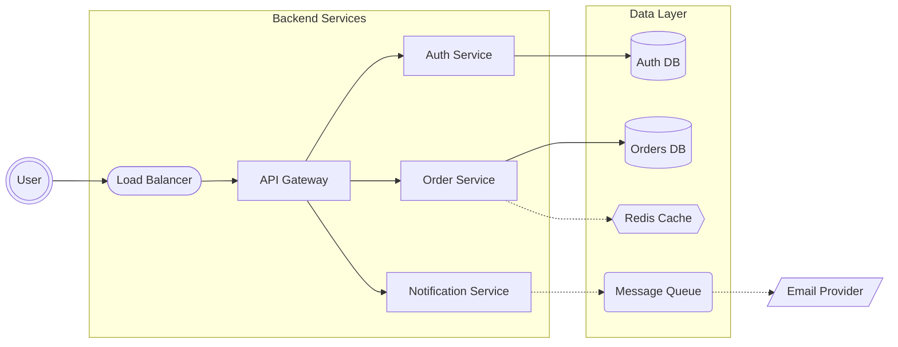

# Architecture Diagram Rules & Standards for Mermaid JS

## Syntax
- Use `flowchart LR` (left-to-right) for horizontal architecture layouts.
- Use `flowchart TD` for vertical/layered architecture layouts.
- Use subgraphs extensively to represent layers, services, or bounded contexts.

## Node Shape Standards
- **Rectangle** `[Service Name]` → Microservice / API / Application
- **Cylinder** `[(Database)]` → Database / Data Store
- **Stadium** `([Load Balancer])` → Entry point / Gateway / Load Balancer
- **Hexagon** `{{Cache}}` → Cache layer (Redis, Memcached)
- **Rounded Rectangle** `(Queue)` → Message Queue / Event Bus
- **Parallelogram** `[/External API/]` → Third-party / External service
- **Double Circle** `(((User)))` → Actor / User / Client
- **Subroutine** `[[Shared Library]]` → Shared module / Common service

## Edge/Arrow Standards
- `-->` Synchronous request (HTTP, gRPC)
- `-.->` Asynchronous communication (events, queues)
- `==>` Data flow (primary data pipeline)
- `-->|protocol|` Label with protocol (REST, GraphQL, WebSocket)
- `<-->` Bidirectional communication

## Subgraph Usage (Critical)
Always use an ID for a subgraph and put the human-readable title in brackets to avoid syntax errors with spaces.
```
subgraph frontendLayer [Frontend Layer]
    web[Web App]
    mobile[Mobile App]
end

subgraph backendLayer [Backend Layer]
    api[API Gateway]
    auth[Auth Service]
end

subgraph dataLayer [Data Layer]
    db[(PostgreSQL)]
    cache{{Redis}}
end
```

## Best Practices
1. **BLOCK-BASED DESIGN**: Always organize into logical layers (Client, Gateway, Services, Data) using subgraphs. Do not just throw all nodes onto the canvas; put them in their designated blocks.
2. **CLEAN CONNECTIONS**: Keep the diagram clean and simplified. Connect blocks logically (e.g., flow from Frontend -> Gateway -> Backend -> Data). Avoid crossing lines aggressively.
3. **SUBGRAPH STRICT SYNTAX**: NEVER use spaces directly after the `subgraph` keyword without an ID. ALWAYS use the format `subgraph id [Visible Name with Spaces]`. 
4. **AVOID "HUB AND SPOKE" NOODLES**: Do not draw connections from every single node in different subgraphs to a single central node (like an S3 bucket or Message Broker). This creates messy, overlapping "noodle" arrows. Instead, logically group shared resources closer to their dependents, or route connections between subgraphs rather than between every individual node.
5. **DRASTICALLY MINIMIZE EDGE LABELS**: Avoid applying repetitive labels (like "events" or "publish") to every single edge. If many services perform the same action, leaving the edges unlabeled is much cleaner. Only label crucial or protocol-specific connections (e.g., `-->|"REST API"|`).
6. **MINIMIZE CROSS-SUBGRAPH LINKS**: Limit drawing connections between very distant nodes lying in different subgraphs. Layouts should be modeled so data flows sequentially between adjacent subgraphs.
7. Separate synchronous (solid arrows) from asynchronous (dotted arrows) flows.
8. Include databases, caches, and message queues as distinct node types.
9. Use descriptive subgraph titles (e.g., "Authentication Block" not just "Auth").
10. Show external dependencies clearly (third-party APIs, CDNs) in their own "External" subgraph.
11. Maximum 25-30 nodes for clarity. Consolidate repetitive nodes into a group block if it gets too large. Group tightly-coupled services together within the same subgraph.
12. **CRITICAL SYNTAX**: ALWAYS double-quote the text inside shapes to avoid parser crashes from commas/colons/apostrophes. Example: `A["User's Data, List"]`.
13. **NO MULTIPLE ARROWS**: Never draw multiple arrows extending in the exact same direction between two identical nodes.
14. **RESERVED KEYWORDS**: NEVER use the word `end` as a node ID (e.g., `end[Finish]`). This is a reserved Mermaid keyword for subgraphs and will crash the renderer. Use `finish`, `done`, or `endNode` instead.
15. **SIMPLICITY FIRST**: For all architecture requests, even complex ones, divide it into main blocks and connect the blocks in a simplified way. Don't overcomplicate the structure.
16. **NO NAKED ANGLE BRACKETS**: NEVER use the symbols `<` or `>` inside a label. They crash the renderer. Use the written words `less than` or `greater than` instead. (e.g., `["Latency: less than 100ms"]`)
17. **NO SUBGRAPH CONNECTIONS**: Never draw an arrow connecting directly to a `subgraph ID`. This causes massive layout stability issues in large diagrams. Always connect to the 'entry' or 'gateway' node within that subgraph.
18. **FORCE QUOTED LABELS**: ALWAYS wrap everything inside `[" "]`. This prevents commas, hyphens, and technology dots (like .5 in X.509) from breaking the syntax.
19. **UNIQUE NODE IDs**: Ensure all node IDs are unique across all subgraphs. Never repeat IDs.
20. **LAYERED BLOCK DESIGN**: For deep tech stacks (like IoT), use 4-5 clearly layered subgraphs (e.g., 'Edge', 'Ingestion', 'Processing', 'App') and ensure data flows linearly from layer to layer.

## Example


## Common Patterns
- **3-Tier**: Client → Server → Database
- **Microservices**: Gateway → Service Mesh → Individual Services → Databases
- **Event-Driven**: Producer → Event Bus → Consumers
- **Serverless**: API Gateway → Lambda Functions → DynamoDB
