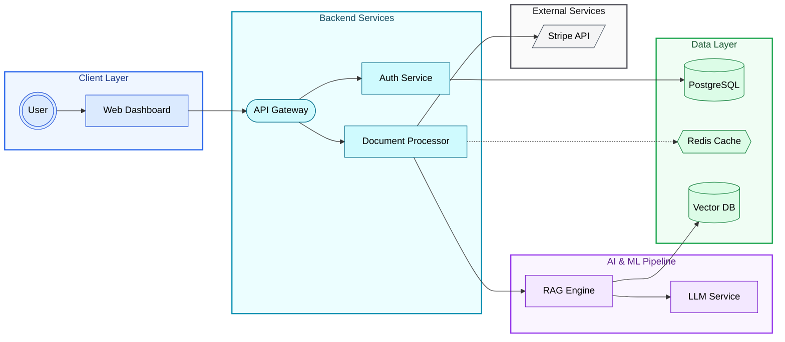

# Architecture Diagram Rules & Standards for Mermaid JS

## Syntax
- Use `flowchart LR` (left-to-right) for horizontal architecture layouts.
- Use `flowchart TD` for vertical/layered architecture layouts.
- Use subgraphs extensively to represent layers, services, or bounded contexts.

## Node Shape Standards
- **Rectangle** `[Service Name]` → Microservice / API / Application
- **Cylinder** `[(Database)]` → Database / Data Store
- **Stadium** `([Load Balancer])` → Entry point / Gateway / Load Balancer
- **Hexagon** `{{Cache}}` → Cache layer (Redis, Memcached)
- **Rounded Rectangle** `(Queue)` → Message Queue / Event Bus
- **Parallelogram** `[/External API/]` → Third-party / External service
- **Double Circle** `(((User)))` → Actor / User / Client
- **Subroutine** `[[Shared Library]]` → Shared module / Common service

## Edge/Arrow Standards
- `-->` Synchronous request (HTTP, gRPC)
- `-.->` Asynchronous communication (events, queues)
- `==>` Data flow (primary data pipeline)
- `-->|protocol|` Label with protocol (REST, GraphQL, WebSocket)
- `<-->` Bidirectional communication

## Semantic Node & Subgraph Coloring
Color should represent semantics, not aesthetics. Use a consistent, low-saturation pastel palette across all generated architecture diagrams.

### Semantic Color Coding
- **Client / UI** (Soft Blue):
  - Subgraph Style: `style clientLayer fill:#eff6ff,stroke:#2563eb,stroke-width:2px,color:#1e3a8a;`
  - Node Class Def: `classDef clientNode fill:#dbeafe,stroke:#1d4ed8,color:#000000;`
- **Backend Services / APIs** (Cyan):
  - Subgraph Style: `style backendLayer fill:#ecfeff,stroke:#0891b2,stroke-width:2px,color:#164e63;`
  - Node Class Def: `classDef backendNode fill:#cffafe,stroke:#0e7490,color:#000000;`
- **AI / ML / LLM / RAG** (Purple):
  - Subgraph Style: `style aiLayer fill:#faf5ff,stroke:#9333ea,stroke-width:2px,color:#581c87;`
  - Node Class Def: `classDef aiNode fill:#f3e8ff,stroke:#7e22ce,color:#000000;`
- **Infrastructure / Compute** (Orange):
  - Subgraph Style: `style infraLayer fill:#fff7ed,stroke:#ea580c,stroke-width:2px,color:#7c2d12;`
  - Node Class Def: `classDef infraNode fill:#ffedd5,stroke:#c2410c,color:#000000;`
- **Databases / Storage / Cache** (Green):
  - Subgraph Style: `style dataLayer fill:#f0fdf4,stroke:#16a34a,stroke-width:2px,color:#14532d;`
  - Node Class Def: `classDef dataNode fill:#dcfce7,stroke:#15803d,color:#000000;`
- **Messaging / Queues / Events** (Yellow):
  - Subgraph Style: `style msgLayer fill:#fefce8,stroke:#ca8a04,stroke-width:2px,color:#713f12;`
  - Node Class Def: `classDef msgNode fill:#fef9c3,stroke:#a16207,color:#000000;`
- **Monitoring / Logging / Alerts** (Red):
  - Subgraph Style: `style monitorLayer fill:#fef2f2,stroke:#dc2626,stroke-width:2px,color:#7f1d1d;`
  - Node Class Def: `classDef monitorNode fill:#fee2e2,stroke:#b91c1c,color:#000000;`
- **External / Third-party** (Gray):
  - Subgraph Style: `style extLayer fill:#fafafa,stroke:#52525b,stroke-width:2px,color:#18181b;`
  - Node Class Def: `classDef extNode fill:#f4f4f5,stroke:#4b5563,color:#000000;`

### Grouping and Layout Rules
1. **Group Components into Layers (Subgraphs)**: Subsystems must never be floating nodes. Always organize them into logical layers using subgraphs (e.g., clientLayer, backendLayer, aiLayer, dataLayer, monitorLayer, extLayer).
2. **Container Opacity & Background**: Subgraph backgrounds must be extremely light/low-saturation (5-10% opacity, using the fill colors defined above) and lighter than the nodes inside them to maintain visual hierarchy.
3. **Container Border & Title Color**: The subgraph container border and title text color must match its semantic color (configured via the `style` statement at the bottom of the diagram).
4. **Group Similar Components**: Within a layer, cluster related services together. Exclude external systems (e.g., OpenAI, Stripe, GitHub Actions) from backend containers; place them in their own `extLayer` or `infraLayer`.
5. **AI Cluster**: Keep LLMs, vector databases, RAG engines, embeddings, and retrievers grouped in an AI Layer styled with Purple.
6. **Visual Hierarchy & Flow**: Structure diagrams logically (usually left-to-right flow: Client -> Backend -> AI/Data, or top-down: Client -> Gateway -> Backend -> Queue/Database). Supporting systems (Monitoring, CI/CD) should sit on the sides/bottom.
7. **Minimal Connections**: Connect containers cleanly. Avoid crossing lines or making redundant connections between individual nodes across layers. Keep connectors and arrowheads neutral (black/dark gray) and unlabeled unless indicating a specific protocol.

## Best Practices
1. **SUBGRAPH STRICT SYNTAX**: Always use format `subgraph id [Visible Name with Spaces]`. Never use spaces directly after the `subgraph` keyword without an ID.
2. **CRITICAL SYNTAX**: ALWAYS double-quote the text inside shapes to avoid parser crashes from commas/colons/apostrophes. Example: `A["User's Data, List"]`.
3. **NO MULTIPLE ARROWS**: Never draw multiple arrows extending in the exact same direction between two identical nodes.
4. **RESERVED KEYWORDS**: NEVER use the word `end` as a node ID. Use `finish`, `done`, or `endNode` instead.
5. **NO SUBGRAPH CONNECTIONS**: Never draw an arrow connecting directly to a `subgraph ID`. Connect to the 'entry' or 'gateway' node within that subgraph.
6. **UNIQUE NODE IDs**: Ensure all node IDs are unique across all subgraphs. Never repeat IDs.

## Example

## Common Patterns
- **3-Tier**: Client Layer → Backend Services → Data Layer
- **Microservices**: clientLayer → gatewayNode → backendLayer (services) → dataLayer
- **Event-Driven**: Producers → Event Broker (messaging) → Consumers (backend/data)
