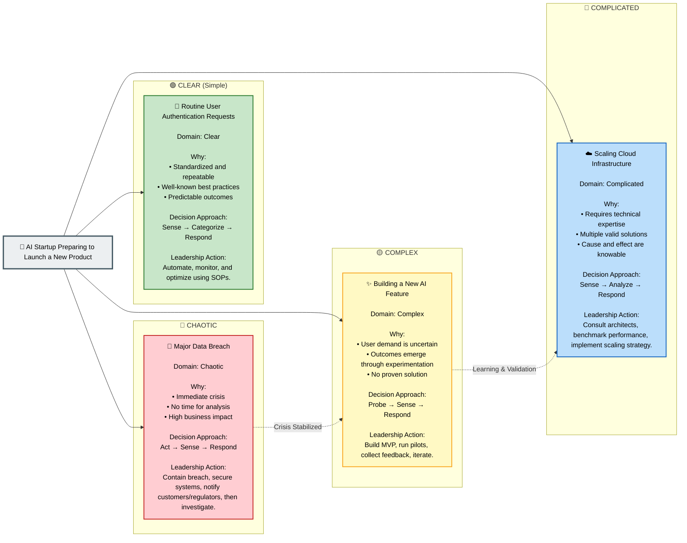

# Cynefin Framework Diagram Rules & Standards for Mermaid JS

Cynefin is a decision-making framework that helps classify situations into domains to guide leadership responses. This document outlines the standard flowchart structure, multiline text format, and color rules for generating Cynefin diagrams in Arka.

## Syntax & Layout
- Always start with `flowchart LR` or `flowchart TB`.
- Define a **Central Theme Node** at the top/center (e.g. `A["🏢 AI Startup Preparing to Launch a New Product"]`).
- Group situation nodes inside 4 distinct domain subgraphs representing the quadrants:
  - `subgraph CLEAR["🟢 CLEAR (Simple)"]`
  - `subgraph COMPLICATED["🔵 COMPLICATED"]`
  - `subgraph COMPLEX["🟡 COMPLEX"]`
  - `subgraph CHAOTIC["🔴 CHAOTIC"]`
- Connect the Central Theme Node to every situation node inside the subgraphs (e.g. `A --> C1`, `A --> P1`).
- Add **dotted links** to show domain transitions (e.g. `X1 -. Learning & Validation .-> P2`).

## Rich Multiline Nodes
Every situation node inside a domain MUST use a multiline label enclosed in double quotes containing:
1. An emoji + situation title
2. **Domain**: name
3. **Why**: 2-3 bulleted reasons explaining the classification
4. **Decision Approach**: (e.g. `Sense → Categorize → Respond`)
5. **Leadership Action**: action details

### Example Node Format
```
C1["🔐 Routine User Authentication Requests

Domain: Clear

Why:
• Standardized and repeatable
• Well-known best practices
• Predictable outcomes

Decision Approach:
Sense → Categorize → Respond

Leadership Action:
Automate, monitor, and optimize using SOPs."]
```

## Color Scheme Class Definitions
You must define and apply the following exact classDefs at the bottom of the diagram code:

```mermaid
classDef clear fill:#C8E6C9,stroke:#2E7D32,color:#000,stroke-width:2px;
classDef complicated fill:#BBDEFB,stroke:#1565C0,color:#000,stroke-width:2px;
classDef complex fill:#FFF9C4,stroke:#F9A825,color:#000,stroke-width:2px;
classDef chaotic fill:#FFCDD2,stroke:#C62828,color:#000,stroke-width:2px;
classDef center fill:#ECEFF1,stroke:#455A64,color:#000,stroke-width:3px;
```

And assign them to their respective nodes:
```mermaid
class A center;
class C1 clear;
class P1,P2 complicated;
class X1,X2 complex;
class H1 chaotic;
```

---

## Complete Example Diagram

