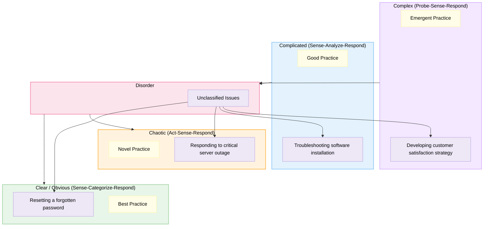

# Cynefin Framework Diagram Rules & Standards for Mermaid JS

The Cynefin framework helps decision-makers identify how they perceive situations and make sense of organizational behavior. It classifies problems into 5 domains: Complex, Complicated, Chaotic, Clear (Obvious), and Disorder.

## Syntax
- Always start with `flowchart TD`.
- Represent domains using subgraphs.
- Represent scenario items, decision steps, or actions using nodes.
- Style subgraphs using `style subgraphId fill:#HEX,stroke:#HEX,stroke-width:2px,color:#000000` statements at the bottom of the diagram.

## Color Palette Rules (MANDATORY)
You MUST apply these exact colors to subgraphs and elements in every Cynefin diagram:

| Element / Domain | Color Name | Hex Code | Purpose / Styling |
|---|---|---|---|
| **Complex Domain** | Soft Purple | `#F3E8FF` | `style complex fill:#F3E8FF,stroke:#D8B4FE,stroke-width:2px,color:#000000` |
| **Complicated Domain** | Soft Blue | `#E3F2FD` | `style complicated fill:#E3F2FD,stroke:#90CAF9,stroke-width:2px,color:#000000` |
| **Clear/Obvious Domain** | Soft Green | `#E8F5E9` | `style clear fill:#E8F5E9,stroke:#A5D6A7,stroke-width:2px,color:#000000` |
| **Chaotic Domain** | Soft Orange | `#FFF3E0` | `style chaotic fill:#FFF3E0,stroke:#FFB74D,stroke-width:2px,color:#000000` |
| **Disorder Domain** | Soft Pink | `#FCE4EC` | `style disorder fill:#FCE4EC,stroke:#F48FB1,stroke-width:2px,color:#000000` |
| **Actions/Decision Nodes** | Soft Yellow | `#FFFDE7` | Applied via `classDef action fill:#FFFDE7,stroke:#FFF59D,color:#000000;` |
| **Scenario Nodes** | Soft Lavender | `#EDE7F6` | Applied via `classDef scenario fill:#EDE7F6,stroke:#B39DDB,color:#000000;` |
| **Additional/Info Nodes** | Soft Cyan | `#E0F7FA` | Applied via `classDef info fill:#E0F7FA,stroke:#80DEEA,color:#000000;` |

## 2x2 Quadrant Structure (MANDATORY)
A proper Cynefin diagram must be rendered in a 2x2 grid layout (quadrants) with Disorder in the center:
- **Top-Left**: Complex
- **Top-Right**: Complicated
- **Center**: Disorder
- **Bottom-Left**: Chaotic
- **Bottom-Right**: Clear

To force Mermaid to render this 2x2 grid correctly, you MUST append these layout alignment links at the bottom of the diagram (right before styling declarations):
```mermaid
    %% Force 2x2 Layout Structure
    complex ~~~ complicated
    complex --> disorder
    complicated --> disorder
    disorder --> chaotic
    disorder --> clear
    chaotic ~~~ clear
```

## CRITICAL Anti-Patterns — NEVER DO THESE

### 1. NEVER Put Styling Parameters in Subgraph Titles
Do not include text like `fill:#...` or `stroke:#...` in the subgraph labels or title string. Styling statements must be declared on their own lines at the very bottom of the code.
- **WRONG**: `subgraph complex ["Complex fill:#F3E8FF"]`
- **CORRECT**: `subgraph complex ["Complex Domain"]` and then `style complex fill:#F3E8FF` at the bottom of the file.

### 2. NEVER Use Self-Loop Links
Do not create links pointing a node back to itself (e.g. `node1 --> node1`). This is invalid syntax and crashes the Mermaid engine.
- **WRONG**: `B1 -->|Sense-Analyze-Respond| B1`
- **CORRECT**: Map a clear progression or omit self-loops entirely.

### 3. NEVER Nest Domain Subgraphs
Keep subgraphs flat. Putting subgraphs inside other subgraphs for domains causes unpredictable layout issues.
- **WRONG**:
```mermaid
subgraph Cynefin Framework
    subgraph Clear/Obvious
        node1
    end
end
```
- **CORRECT**: Keep each domain subgraph flat at the top-level of the diagram.

---

## Example Cynefin Framework Diagram

