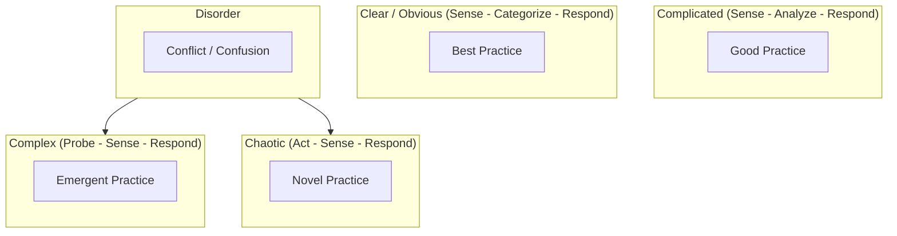

# Cynefin Framework Diagram Rules & Standards for Mermaid JS

## Syntax
- Always start with `flowchart TD` or `flowchart LR`.
- Use subgraphs to represent the Cynefin domains.
- Nodes represent concepts, actions, or states inside domains.

## Structure
- Obvious / Clear (bottom-right)
- Complicated (top-right)
- Complex (top-left)
- Chaotic (bottom-left)
- Disorder (center)

## Example

