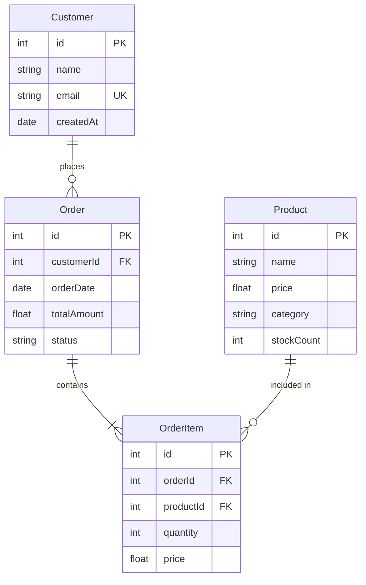

# Entity-Relationship Diagram Rules & Standards for Mermaid JS

## Syntax
- First line MUST be `erDiagram`.
- Define entities and their relationships.
- Each entity is automatically rendered as a box with its attributes listed inside.

## Entity Definition
- Entities are defined implicitly when used in relationships or explicitly with attributes.
- Entity names MUST be single words or use camelCase — NO spaces, NO hyphens, NO special characters.
  - GOOD: `Customer`, `OrderItem`, `ShippingAddress`
  - BAD: `Order Item`, `shipping-address`, `user's_profile`

## Attribute Syntax
- Attributes go inside curly braces after the entity name.
- Format: `type name comment`
- Types: `string`, `int`, `float`, `boolean`, `date`, `datetime`, `varchar`, `text`, `uuid`, `bigint`, `enum`
- Key markers (as comments): `PK` (Primary Key), `FK` (Foreign Key), `UK` (Unique Key)

```
EntityName {
    type attributeName "constraint"
    int id PK
    string name
    int orderId FK
    string email UK
}
```

## Relationship Syntax
- Format: `EntityA relationship EntityB : "label"`
- The label MUST be enclosed in double quotes.
- **CRITICAL**: The relationship label is REQUIRED. Every relationship line MUST have a colon and a quoted label.

### Relationship Cardinality Markers
- `||--||` One to one (exactly one on both sides)
- `||--o{` One to many (one on left, zero or more on right)
- `||--|{` One to many (one on left, one or more on right)
- `o{--o{` Many to many (zero or more on both sides)
- `|{--|{` Many to many (one or more on both sides)
- `o|--o{` Zero or one to zero or many

### Marker Reference
- `||` — exactly one
- `o|` — zero or one
- `|{` — one or more
- `o{` — zero or more

## Best Practices
1. **LIMIT ENTITIES**: Keep to 4-10 entities per diagram. More than 10 becomes cluttered and unreadable.
2. **ESSENTIAL ATTRIBUTES ONLY**: Show 3-6 key attributes per entity (PK, FKs, and 2-3 important fields). Don't list every column.
3. **ALWAYS LABEL RELATIONSHIPS**: Every relationship MUST have a descriptive label like `"places"`, `"contains"`, `"belongs to"`.
4. **PK/FK DISCIPLINE**: Always mark primary keys and foreign keys. This is the whole point of an ER diagram.
5. **NAMING CONVENTION**: Use singular PascalCase for entity names (`Customer` not `customers`).
6. **NO SPECIAL CHARACTERS**: Entity names and attribute names must NOT contain spaces, hyphens, or special characters.
7. **RELATIONSHIP DIRECTION**: Read relationships left-to-right as a sentence: `Customer ||--o{ Order : "places"` → "A Customer places zero or more Orders".
8. **AVOID REDUNDANT RELATIONSHIPS**: Don't create a direct relationship between two entities if the relationship is already implied through an intermediary (junction) table.
9. **JUNCTION TABLES**: For many-to-many relationships, always use a junction/association entity (e.g., `StudentCourse` between `Student` and `Course`).

## CRITICAL Anti-Patterns — NEVER DO THESE

### 1. NEVER Duplicate Entity Definitions
Each entity MUST appear EXACTLY ONCE in the diagram. Never define the same entity block more than once.
- **WRONG** (entity defined twice):
```
Book {
    int id PK
    string title
}
Book {
    int id PK
    string title
}
```
- **CORRECT** (entity defined once):
```
Book {
    int id PK
    string title
}
```

### 2. NEVER Duplicate Relationship Lines
Each relationship between two entities MUST appear EXACTLY ONCE. Never repeat the same pair.
- **WRONG** (same relationship repeated):
```
Billing ||--o{ Patient : "for"
Billing ||--o{ Patient : "for"
Billing ||--o{ Patient : "for"
```
- **CORRECT** (stated once):
```
Billing ||--o{ Patient : "for"
```

### 3. NEVER Write Bidirectional Duplicate Relationships
A relationship between EntityA and EntityB should only be stated ONCE, from ONE direction. Do NOT state the same relationship from both sides.
- **WRONG** (same relationship stated twice, from each side):
```
Order ||--o{ Coupon : "applies"
Coupon ||--o{ Order : "applied to"
```
- **CORRECT** (stated once, from the most natural direction):
```
Order ||--o{ Coupon : "uses"
```

### 4. NEVER Use `enum` Blocks
Mermaid ER diagrams do NOT support `enum` syntax. Enums are not entities. If you need to represent status values, include them as a `string status` attribute inside the relevant entity.
- **WRONG** (invalid Mermaid syntax):
```
enum OrderStatus {
    PENDING
    ACTIVE
    COMPLETED
}
Order ||--|| OrderStatus : "has status"
```
- **CORRECT** (status as an attribute):
```
Order {
    int id PK
    string status
}
```

### 5. NEVER Create Empty Entities
Every entity MUST have at least a primary key attribute. Never define an entity with an empty body.
- **WRONG**:
```
Librarian {
}
```
- **CORRECT**:
```
Librarian {
    int id PK
    string name
    string email UK
}
```

### 6. NEVER Create Self-Referencing Relationships Without Purpose
Do not create meaningless self-references like `Book ||--o{ Book : "has"`. Self-references are only valid for hierarchical data (e.g., `Employee ||--o{ Employee : "manages"`).

### 7. NEVER Write Incomplete/Truncated Relationship Lines
Every relationship line MUST have both a source entity and a target entity, followed by a colon and a quoted label. Never leave a relationship line unfinished.
- **WRONG** (truncated):
```
Notification ||--
```
- **CORRECT**:
```
Notification ||--|| Order : "related to"
```

### 8. NEVER Create "Hub" Entities Connected to Everything
Avoid connecting a single entity (like `Notification` or `Billing`) to every other entity in the diagram. This creates an unreadable spider web. Instead, connect it only to the 2-3 entities it truly depends on via foreign keys.
- **WRONG** (Notification connected to 10 entities):
```
Notification ||--|| Order : "related to"
Notification ||--|| User : "related to"
Notification ||--|| DeliveryPartner : "related to"
Notification ||--|| Restaurant : "related to"
Notification ||--|| Coupon : "related to"
Notification ||--|| Review : "related to"
Notification ||--|| Address : "related to"
Notification ||--|| Payment : "related to"
```
- **CORRECT** (Notification connected only to its real FKs):
```
Notification ||--|| User : "sent to"
Notification ||--|| Order : "about"
```

### 9. NEVER Exceed Entity or Relationship Limits
- Maximum 10 entities per diagram.
- Maximum 3-6 attributes per entity.
- Maximum 15 relationship lines total. If you need more, the diagram is too complex — simplify or split it.

## Structural Rules Summary
- Each entity name appears in at most ONE `EntityName { ... }` block.
- Each ordered pair `(EntityA, EntityB)` appears in at most ONE relationship line.
- No `enum` blocks — use string attributes instead.
- No empty entity bodies — always include at least a PK.
- No truncated lines — every relationship must be syntactically complete.
- Total entities ≤ 10, total relationships ≤ 15.

## Example


## Common Patterns
- **One-to-Many**: Customer → Orders, Author → Books
- **Many-to-Many** (via junction): Student ↔ StudentCourse ↔ Course
- **Self-Reference**: Employee → manages → Employee (use a junction or recursive FK)
- **Inheritance**: Person → Customer, Person → Employee (shared base attributes)
