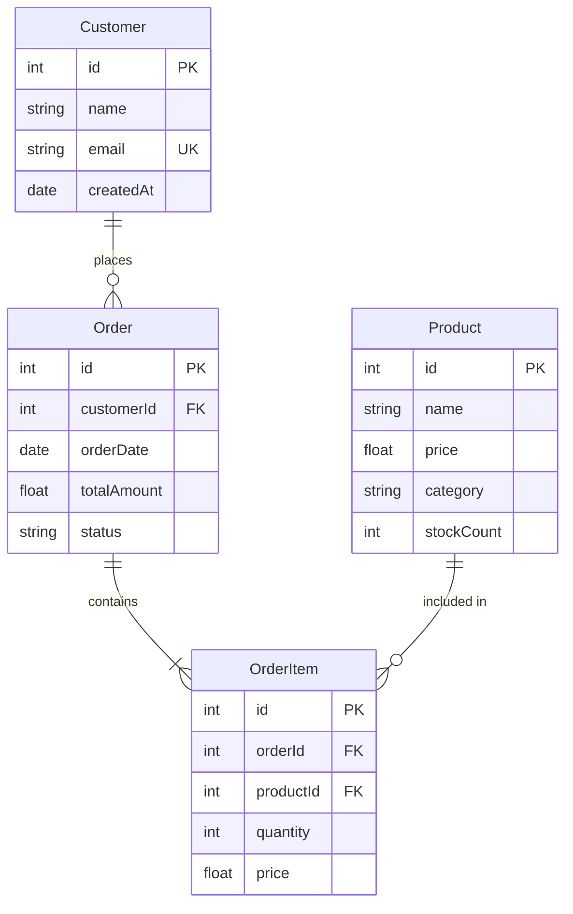

# Entity-Relationship Diagram Rules & Standards for Mermaid JS

## Syntax
- First line MUST be `erDiagram`.
- Define entities and their relationships.
- Each entity is automatically rendered as a box with its attributes listed inside.

## Entity Definition
- Entities are defined implicitly when used in relationships or explicitly with attributes.
- Entity names MUST be single words or use camelCase — NO spaces, NO hyphens, NO special characters.
  - GOOD: `Customer`, `OrderItem`, `ShippingAddress`
  - BAD: `Order Item`, `shipping-address`, `user's_profile`

## Attribute Syntax
- Attributes go inside curly braces after the entity name.
- Format: `type name comment`
- Types: `string`, `int`, `float`, `boolean`, `date`, `datetime`, `varchar`, `text`, `uuid`, `bigint`, `enum`
- Key markers (as comments): `PK` (Primary Key), `FK` (Foreign Key), `UK` (Unique Key)

```
EntityName {
    type attributeName "constraint"
    int id PK
    string name
    int orderId FK
    string email UK
}
```

## Relationship Syntax
- Format: `EntityA relationship EntityB : "label"`
- The label MUST be enclosed in double quotes.
- **CRITICAL**: The relationship label is REQUIRED. Every relationship line MUST have a colon and a quoted label.

### Relationship Cardinality Markers
- `||--||` One to one (exactly one on both sides)
- `||--o{` One to many (one on left, zero or more on right)
- `||--|{` One to many (one on left, one or more on right)
- `o{--o{` Many to many (zero or more on both sides)
- `|{--|{` Many to many (one or more on both sides)
- `o|--o{` Zero or one to zero or many

### Marker Reference
- `||` — exactly one
- `o|` — zero or one
- `|{` — one or more
- `o{` — zero or more

## Best Practices
1. **LIMIT ENTITIES**: Keep to 4-10 entities per diagram. More than 10 becomes cluttered and unreadable.
2. **ESSENTIAL ATTRIBUTES ONLY**: Show 3-6 key attributes per entity (PK, FKs, and 2-3 important fields). Don't list every column.
3. **ALWAYS LABEL RELATIONSHIPS**: Every relationship MUST have a descriptive label like `"places"`, `"contains"`, `"belongs to"`.
4. **PK/FK DISCIPLINE**: Always mark primary keys and foreign keys. This is the whole point of an ER diagram.
5. **NAMING CONVENTION**: Use singular PascalCase for entity names (`Customer` not `customers`).
6. **NO SPECIAL CHARACTERS**: Entity names and attribute names must NOT contain spaces, hyphens, or special characters.
7. **RELATIONSHIP DIRECTION**: Read relationships left-to-right as a sentence: `Customer ||--o{ Order : "places"` → "A Customer places zero or more Orders".
8. **AVOID REDUNDANT RELATIONSHIPS**: Don't create a direct relationship between two entities if the relationship is already implied through an intermediary (junction) table.
9. **JUNCTION TABLES**: For many-to-many relationships, always use a junction/association entity (e.g., `StudentCourse` between `Student` and `Course`).

## Example


## Common Patterns
- **One-to-Many**: Customer → Orders, Author → Books
- **Many-to-Many** (via junction): Student ↔ StudentCourse ↔ Course
- **Self-Reference**: Employee → manages → Employee (use a junction or recursive FK)
- **Inheritance**: Person → Customer, Person → Employee (shared base attributes)

## Anti-Patterns to AVOID
- Listing 15+ attributes per entity (pick only the essential ones)
- Using spaces in entity names (`Order Item` instead of `OrderItem`)
- Missing relationship labels (ALWAYS have `"label"` after the colon)
- Circular relationships without junction tables
- Using abbreviations for entity names that nobody understands
