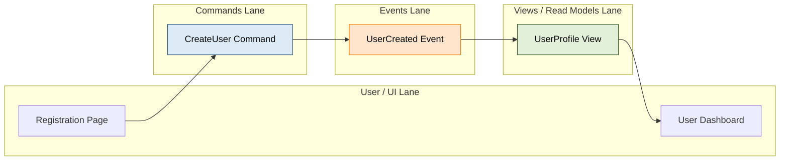

# Event Modeling Rules & Standards for Mermaid JS

## Syntax
- Always start with `flowchart LR` (Left-to-Right timeline).
- Create 4 horizontal swimlanes:
  - Users / UI
  - Commands (Blue / Action)
  - Events (Orange / Fact)
  - Views / Read Models (Green)
- Link sequentially left-to-right to show information flow over time.

## Example

