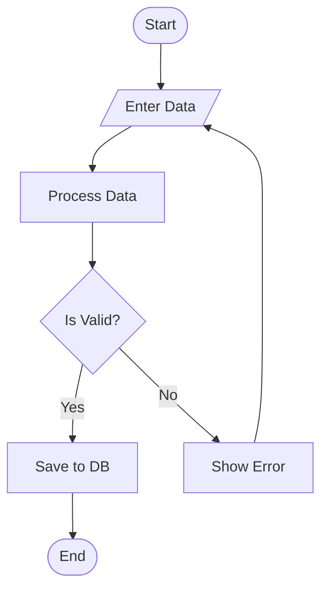

# Flowchart Rules & Standards for Mermaid JS

## Syntax
- Always start with `flowchart TD` (top-down) or `flowchart LR` (left-right).
- Use `TD` for vertical flows, `LR` for horizontal flows.

## Node Shape Standards
- **Rectangle** `[text]` → Process / Action step
- **Rounded Rectangle** `(text)` → Start / End / Terminal
- **Diamond** `{text}` → Decision / Conditional
- **Parallelogram** `[/text/]` → Input / Output
- **Hexagon** `{{text}}` → Preparation / Setup
- **Circle** `((text))` → Connector / Junction
- **Stadium** `([text])` → Start / End (alternate)
- **Subroutine** `[[text]]` → Predefined process / Function call
- **Cylinder** `[(text)]` → Database / Storage
- **Trapezoid** `[/text\]` → Manual operation
- **Double Circle** `(((text)))` → Critical endpoint

## Edge/Arrow Standards
- `-->` Solid arrow (normal flow)
- `-.->` Dotted arrow (optional flow)
- `==>` Thick arrow (primary/critical path)
- `-->|label|` Arrow with label (condition text)
- `---` Line without arrow

## Best Practices
1. Every flowchart MUST have a clear Start and End node.
2. Always label decision branches clearly.
3. **CRITICAL SYNTAX**: ALWAYS double-quote the text inside shapes to avoid parser crashes from commas/colons/apostrophes. Example: `A["User's Data, List"]`.
4. **NO MULTIPLE ARROWS**: Never draw multiple arrows extending in the exact same direction between two identical nodes.
5. **RESERVED KEYWORDS**: NEVER use the word `end` as a node ID (e.g., `end[Finish]`). This is a reserved Mermaid keyword for subgraphs and will crash the renderer. Use `finish`, `done`, or `endNode` instead.
6. **SIMPLICITY FIRST**: For basic prompts (e.g., "user login"), do not exceed 6-8 nodes. Focus ONLY on the primary 'Happy Path'. Do not add complex error handling unless explicitly requested.
7. **EDGE STYLING SYNTAX**: NEVER use `-->|style className|` or `-->|classDef|` to style edges or arrows. The inline label syntax `|text|` is STRICTLY for printing visible label text on an arrow. To style edges, use `linkStyle <index> stroke:#hex,stroke-width:2px` at the end of the chart. To style nodes, define classes via `classDef myClass fill:#HEX` and apply them as `nodeId:::myClass`.

## Visual & Layout Structure Optimization
1. **Preventing Start Node Displacement (Invisible Links)**:
   - If a flowchart has complex loops, the logical start node (like `start([Start])`) might get pushed down below loop nodes by the Dagre layout engine.
   - To force the start node to be rendered at the absolute top of the page, define an invisible link `start ~~~ loopNode` at the top of the connections. This forces Dagre to rank the start node at the top.
2. **Phase Partitioning (Subgraphs)**:
   - For complex processes, partition logical blocks (like "Authentication", "Active Session", "Retry Logic") into `subgraph` blocks. This clusters related nodes together, prevents cross-pollution, and maintains a clean, linear layout.
3. **Loop Layout & Orientation**:
   - Loops with long vertical return arrows clutter the diagram. 
   - Define nodes sequentially *before* establishing connections so the layout engine understands their logical order.
   - If a diagram has heavy loop-backs, consider using `flowchart LR` (Left-to-Right) instead of `TD` (Top-Down). In a horizontal layout, loops naturally curve back along the top or bottom edges, making the flow much cleaner and easier to read.

## Example

## Common Patterns
- **Linear Flow**: start → step1 → step2 → end
- **Decision Branch**: step → decision → yes_path / no_path → merge → continue
- **Loop**: step → check → (back to step if condition)
- **Parallel**: step → fork → path1 & path2 → join → continue
