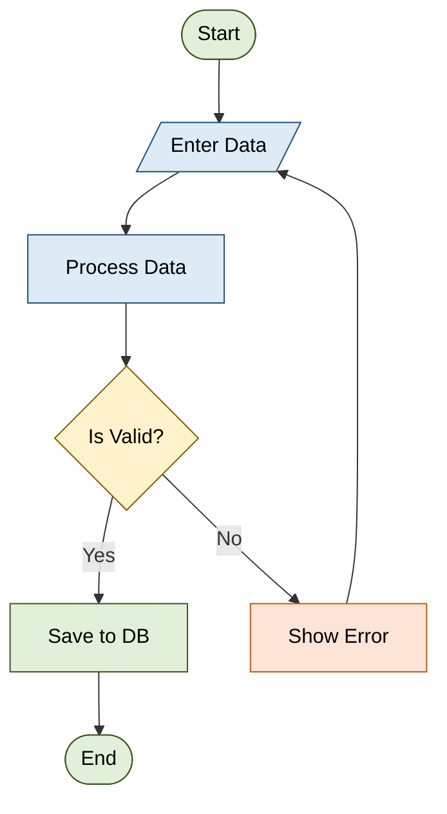

# Flowchart Rules & Standards for Mermaid JS

## Syntax
- Always start with `flowchart TD` (top-down) or `flowchart LR` (left-right).
- Use `TD` for vertical flows, `LR` for horizontal flows.
- **STRICT CODE-ONLY RULE**: The response must contain ONLY the raw Mermaid diagram syntax. Do NOT wrap the diagram in markdown code block fences (e.g., do not use ` ```mermaid ` or ` ``` `). Do NOT include any introductory text, concluding remarks, explanations, conversational comments, or warnings.

## Node Shape Standards
- **STRICT NODE ID RULE**: Every shape in the diagram must have an explicit, alphanumeric node ID preceding its shape definition (e.g., use `startNode([Start])` or `decisionNode{Decision}`). Do NOT output bare shapes (like `([Start])` or `{Decision}`) without a preceding node ID.
- Node IDs must be simple contiguous alphanumeric strings (e.g. `startNode`, `checkPass`). NEVER use spaces, hyphens, or special characters in Node IDs.
- **Rectangle** `[text]` → Process / Action step
- **Rounded Rectangle** `(text)` → Start / End / Terminal
- **Diamond** `{text}` → Decision / Conditional
- **Parallelogram** `[/text/]` → Input / Output
- **Hexagon** `{{text}}` → Preparation / Setup
- **Circle** `((text))` → Connector / Junction
- **Stadium** `([text])` → Start / End (alternate)
- **Subroutine** `[[text]]` → Predefined process / Function call
- **Cylinder** `[(text)]` → Database / Storage
- **Trapezoid** `[/text\]` → Manual operation
- **Double Circle** `(((text)))` → Critical endpoint

## Edge/Arrow Standards
- `-->` Solid arrow (normal flow)
- `-.->` Dotted arrow (optional flow)
- `==>` Thick arrow (primary/critical path)
- `-->|label|` Arrow with label (condition text)
- `---` Line without arrow

## Semantic Node Coloring Rules
Color should represent semantics, not aesthetics. Use a consistent, low-saturation palette across all generated flowcharts. Do not color nodes arbitrarily or alternate colors just for visual appeal.

### Color Mapping Palette
- **Green** (Start, End, Success, Completion): Fills should be soft green, borders darker green.
  - Class definition: `classDef greenNode fill:#e2f0d9,stroke:#385723,color:#000000;`
- **Blue** (Process, Action, Operation): Fills should be light blue, borders darker blue.
  - Class definition: `classDef blueNode fill:#ddebf7,stroke:#1f4e78,color:#000000;`
- **Yellow/Cream** (Decision points): Fills should be pale yellow/cream, borders darker gold/brown.
  - Class definition: `classDef yellowNode fill:#fff2cc,stroke:#7f6000,color:#000000;`
- **Red** (Errors, Failures, Rollbacks, Cancellations, Escalations, Warnings): Fills should be soft red, borders darker red.
  - Class definition: `classDef redNode fill:#fce4d6,stroke:#c65911,color:#000000;`
- **Gold** (Logging, Learning, Analytics, Auditing): Fills should be soft gold, borders darker gold.
  - Class definition: `classDef goldNode fill:#fff2cc,stroke:#d68a00,color:#000000;`

### Coloring Best Practices
1. **Low Saturation**: Always use muted, pastel colors (avoid neon, bright red, pure yellow, or bright blue) to maintain high readability.
2. **Borders & Fill**: Ensure borders are slightly darker than the fill (as defined in the classes above).
3. **Monochrome Arrows**: Keep connectors and arrowheads monochrome (black or dark gray). Do not style arrows with colors.
4. **Neutral Labels**: Decision labels (e.g., `Yes`, `No`, `Success`, `Failure` on arrows) must remain neutral (black/dark gray).
5. **Palette Limit**: Limit the palette to 5–6 semantic colors in a single diagram.
6. **Consistent Scanning**: Colors should improve visual scanning: follow the "happy path" (mostly blue/green), spot decisions (yellow), failures (red), and logging (gold).
7. **Same Semantic Node = Same Color**: Ensure identical semantic node types always use identical colors across the entire diagram.

## Best Practices
1. Every flowchart MUST have a clear Start and End node.
2. Always label decision branches clearly.
3. **CRITICAL SYNTAX**: ALWAYS double-quote the text inside shapes to avoid parser crashes from commas/colons/apostrophes. Example: `A["User's Data, List"]`.
4. **NO MULTIPLE ARROWS**: Never draw multiple arrows extending in the exact same direction between two identical nodes.
5. **RESERVED KEYWORDS**: NEVER use the word `end` as a node ID (e.g., `end[Finish]`). This is a reserved Mermaid keyword for subgraphs and will crash the renderer. Use `finish`, `done`, or `endNode` instead.
6. **SIMPLICITY FIRST**: For basic prompts (e.g., "user login", "Water Cycle"), do not exceed 6-8 nodes. Focus ONLY on the primary 'Happy Path'. Do not add complex error handling unless explicitly requested.
7. **EDGE STYLING SYNTAX**: NEVER use `-->|style className|` or `-->|classDef|` to style edges or arrows. The inline label syntax `|text|` is STRICTLY for printing visible label text on an arrow. To style edges, use `linkStyle <index> stroke:#hex,stroke-width:2px` at the end of the chart. To style nodes, define classes via `classDef myClass fill:#HEX` and apply them as `nodeId:::myClass`.

## Example


## Common Patterns
- **Linear Flow**: start → step1 → step2 → end
- **Decision Branch**: step → decision → yes_path / no_path → merge → continue
- **Loop**: step → check → (back to step if condition)
- **Parallel**: step → fork → path1 & path2 → join → continue

## Generation Order & Syntax Integrity
To ensure the highest quality rendering and avoid LLM syntax hallucinations, the generation must strictly adhere to the following guidelines:

### 1. Fixed Generation Order
Always generate the Mermaid document in this exact order:
1. Flowchart declaration (e.g., `flowchart TD`)
2. Node definitions
3. Edge/connection definitions
4. Subgraph blocks (if any)
5. Individual style commands (if any)
6. Class assignments (e.g., `class A greenNode`)
7. ClassDef definitions (always at the very end)
Never interleave these sections.

### 2. Syntax Completeness & Token Budget Awareness
- **Never Truncate Output**: Ensure the generated Mermaid code is complete. Never end the output in the middle of a node, edge, classDef, style, or subgraph. Before finishing generation, verify that every opened statement is fully closed.
- **Budget Awareness**: If the diagram approaches the maximum output length, simplify labels or merge repeated nodes instead of truncating the Mermaid code.
- **Never Generate Empty/Incomplete Statements**: Every style, classDef, linkStyle, or node declaration must be syntactically complete. Do not emit dangling or empty declarations (e.g., `classDef redNode fill:` or `style A`).

### 3. Declaration Uniqueness & Deduplication
- **Single classDef Rule**: Each classDef must be declared exactly once. Never redefine the same classDef multiple times (e.g. infinite duplicate declarations of `classDef redNode`). If a class already exists, reuse it.
- **Single Style & Identifier Rule**: A Mermaid identifier (classDef, subgraph name, style name) may only be declared once. Duplicate class definitions or style statements are forbidden.
- **Detect Runaway Repetition**: Detect repeated consecutive Mermaid statements. If an identical statement has already been emitted, do not emit it again.

### 4. Node & Label Design Guidelines
- **One Responsibility Per Node**: Break up long operations into sequential nodes (e.g., instead of one node doing `Reset Attempts, Generate Session, and Redirect`, use three separate nodes connected sequentially).
- **Label Length**: Limit node labels to approximately 3–8 words.
- **Label Escaping & Quotes**: Avoid unnecessary quotation marks inside node labels; prefer plain text labels whenever possible. However, if special characters like commas, colons, or apostrophes are present, double-quote the text to avoid parser crashes (e.g. `A["User's Data, List"]`).
- **Fixed Class Name Vocabulary**: Only use these exact class names for semantic coloring: `greenNode`, `blueNode`, `yellowNode`, `redNode`, `purpleNode`, `grayNode`, `goldNode`. Do not hallucinate variations like `greenNodes`, `green_node`, or `GreenNode`.
- **No Orphan Classes**: Never apply a class assignment (e.g., `class A greenNode` or `A:::greenNode`) without defining the corresponding `classDef` at the end of the file.

## Post-Generation Validation & Cleanup
Before returning the final Mermaid code, perform a rigorous self-linting/validation pass:

### Validation Checklist:
1. **Completion Check**: Verify that the Mermaid code is fully complete and did not end abruptly or get truncated.
2. **Node Reference Check**: Ensure every edge (e.g., `A --> B`) references nodes (`A` and `B`) that exist.
3. **No Duplicate Definitions**: Verify that `classDef` definitions, `style` statements, and duplicate lines are entirely removed/deduplicated.
4. **Subgraph Closure Check**: Verify that all opened subgraphs have a matching `end` keyword.
5. **No Reserved Keywords**: Check that no node ID uses the reserved keyword `end`.
6. **No Inline Edge Styling**: Check that edges are styled correctly (via `linkStyle` if needed) and not with incorrect inline styling.
7. **Render Readiness**: Confirm that the final Mermaid code compiles cleanly without parse errors.
