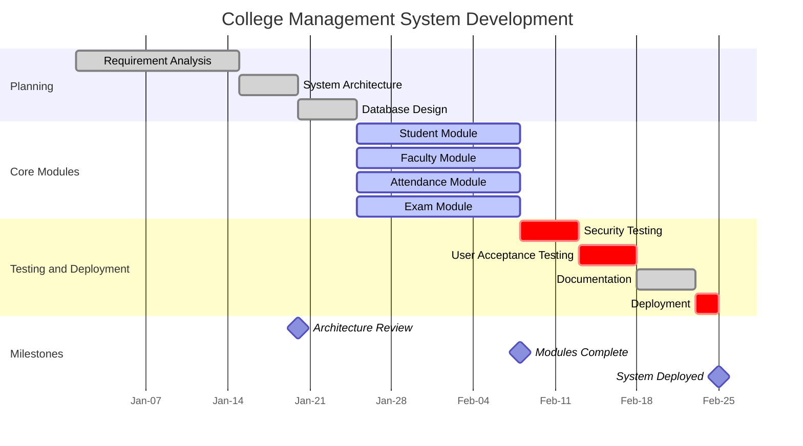

# Gantt Chart Rules & Standards for Mermaid JS

## Syntax
- First line MUST be `gantt`.
- Include a `title` on the second line. NEVER omit the title.
- Define `dateFormat` on the third line (always use `YYYY-MM-DD`).
- Optionally set `axisFormat` for display formatting.
  - **CRITICAL**: `axisFormat` values must NOT contain spaces between format tokens. Use `%b-%d` or `%m-%d`, NEVER `%b %d` (the space breaks parsing and only the first token is used).

## Structure
```
gantt
    title Project Timeline
    dateFormat YYYY-MM-DD
    axisFormat %b-%d

    section Section Name
    Task Name : taskId, startDate, endDate
    Task Name : taskId, after previousTaskId, duration
```

## Task Definition Formats
- **Explicit dates**: `Task : id1, 2024-01-01, 2024-01-15`
- **Duration after dependency**: `Task : id2, after id1, 14d`
- **Duration shorthand**: `7d` (7 days), `2w` (2 weeks). Do NOT use `1M` — use days instead.
- **Active task**: `Task : active, id3, 2024-01-01, 2024-01-15`
- **Done task**: `Task : done, id4, 2024-01-01, 2024-01-15`
- **Critical task**: `Task : crit, id5, 2024-01-01, 2024-01-15`
- **Milestone**: `Milestone Name : milestone, m1, 2024-02-01, 0d`
- **CRITICAL**: When using `after taskId`, provide ONLY the duration — NOT explicit start/end dates. The start is computed from the dependency.
  - GOOD: `Task : id2, after id1, 14d`
  - BAD: `Task : id2, after id1, 2024-01-07, 2024-01-14` (redundant dates conflict with dependency)

## Task Status Markers
- `done` — completed task (rendered lighter/grayed)
- `active` — currently in progress (highlighted)
- `crit` — critical path task (rendered in red)
- `milestone` — zero-duration checkpoint marker
- No marker — future/planned task (default rendering)
- Combine: `crit, done` — critical AND completed

## Dependencies
- `after id1` — start after task id1 finishes
- `after id1 id2` — start after BOTH id1 and id2 finish (multi-dependency, space-separated IDs)
- Dependencies create the logical flow of the project.
- **CRITICAL**: The IDs used in `after` MUST exactly match a previously defined task ID. If you write `after featureIntegration` but the task was defined with id `dev1`, the dependency silently fails.

## Sections
- Use `section Name` to group related tasks.
- Each section gets its own visual grouping row.
- Section names should be short and descriptive (2-4 words).
- **CRITICAL**: Section names must NOT contain `&` or special characters. Use the word `and` instead.
  - GOOD: `section Testing and Deployment`
  - BAD: `section Testing & Deployment`

## Best Practices
1. **ALWAYS USE dateFormat**: The `dateFormat YYYY-MM-DD` line is REQUIRED. Without it, dates will fail to parse.
2. **ALWAYS INCLUDE title**: Every Gantt chart MUST have a `title` line immediately after `gantt`.
3. **CONSISTENT DATE FORMAT**: ALL dates must match the `dateFormat`. If you set `YYYY-MM-DD`, use `2024-01-15` everywhere — never `01/15/2024` or `Jan 15`.
4. **TASK IDs ARE REQUIRED**: Every task MUST have a unique ID for dependency tracking. Use short camelCase IDs like `design1`, `devPhase`, `qaTest`.
5. **KEEP SECTIONS TO 3-6**: Too many sections clutter the chart. Group related work.
6. **LIMIT TASKS PER SECTION**: 3-6 tasks per section is ideal. More than 8 per section is hard to read.
7. **TOTAL TASKS**: Keep the entire chart to 10-25 tasks max for readability.
8. **USE DEPENDENCIES**: Always use `after prevTask` for sequential tasks. This creates a proper flow.
9. **CHOOSE ONE DATE STYLE PER TASK**: Either use explicit dates `2024-01-01, 2024-01-15` OR use `after prevTask, 14d`. NEVER mix both on the same task line.
10. **REALISTIC DURATIONS**: Use realistic time estimates. A "Design" phase of `1d` is unrealistic. Use at least `5d` for major phases.
11. **MILESTONES**: Use milestones (`0d` duration) for key checkpoints like "Design Review", "Sprint Demo", "Launch Date".
12. **NO SPECIAL CHARACTERS IN IDS**: Task IDs must be alphanumeric with no spaces or special characters. `task_1` or `task1` — both work. `task-1` may cause issues.
13. **NO COLONS IN TASK NAMES**: Task names (the display text) must NOT contain colons. Colons are the delimiter. BAD: `Design: Phase 1 : d1, ...`. GOOD: `Design Phase 1 : d1, ...`.
14. **SECTION BEFORE TASKS**: Always declare a `section` before listing tasks belonging to it.
15. **axisFormat WITHOUT SPACES**: If using `axisFormat`, use `%b-%d` or `%m-%d`. NEVER use `%b %d` (space breaks parsing).
16. **VERIFY DEPENDENCY IDS**: Every `after taskId` reference MUST match an existing task ID exactly. Double-check spelling and casing.

## CRITICAL Anti-Patterns — NEVER DO THESE

### 1. NEVER Use Spaces in axisFormat
The `axisFormat` directive uses spaces as delimiters. Putting a space between format tokens causes only the first token to be parsed.
- **WRONG**:
```
axisFormat %b %d
```
- **CORRECT**:
```
axisFormat %b-%d
```

### 2. NEVER Mix `after` Dependencies with Explicit Start Dates
When using `after taskId`, the start date is automatically calculated. Adding explicit start dates creates conflicts and confusion.
- **WRONG** (redundant start date):
```
Frontend Development : dev1, after ui1, 2024-01-07, 2024-01-14
```
- **CORRECT** (duration only):
```
Frontend Development : dev1, after ui1, 8d
```
- **ALSO CORRECT** (explicit dates only, no dependency):
```
Frontend Development : dev1, 2024-01-07, 2024-01-14
```

### 3. NEVER Create Bare Dependency-Only Sections
Never create a `section Dependencies` or similar section that just lists `after` references without dates or durations. These create phantom tasks with no visible representation.
- **WRONG** (bare dependency lines with no duration):
```
section Dependencies
    System Architecture : after req1
    Database Design : after arch1
    API Integration : after arch2
```
- **CORRECT** (dependencies are part of normal task definitions):
```
section Planning
    Requirements : req1, 2024-01-01, 2024-01-15
    System Architecture : arch1, after req1, 5d
    Database Design : db1, after arch1, 5d
```

### 4. NEVER Reference Non-Existent Task IDs in Dependencies
Every `after taskId` MUST reference a task ID that was previously defined. Mismatched IDs cause the dependency to silently fail.
- **WRONG** (references `featureIntegration` but task ID is `dev1`):
```
Feature Integration : dev1, after vec1 admin1, 2024-07-15, 2024-08-01
Security Audit : crit, sec1, after featureIntegration, 14d
```
- **CORRECT** (references the actual task ID `dev1`):
```
Feature Integration : dev1, after vec1 admin1, 18d
Security Audit : crit, sec1, after dev1, 14d
```

### 5. NEVER Use `&` or Special Characters in Section Names
Ampersands and special characters in section names can cause rendering issues. Always use the word `and` instead of `&`.
- **WRONG**:
```
section Testing & Deployment
section AI & Data Services
section Planning & Analysis
```
- **CORRECT**:
```
section Testing and Deployment
section AI and Data Services
section Planning and Analysis
```

### 6. NEVER Omit the Title Line
Every Gantt chart MUST have a `title` line. Without it, the chart renders without context and looks incomplete.
- **WRONG**:
```
gantt
    dateFormat YYYY-MM-DD
    section Tasks
    Task 1 : t1, 2024-01-01, 7d
```
- **CORRECT**:
```
gantt
    title Project Timeline
    dateFormat YYYY-MM-DD
    section Tasks
    Task 1 : t1, 2024-01-01, 7d
```

### 7. NEVER Produce Truncated or Incomplete Gantt Code
Always output a complete, self-contained Gantt chart. Never stop mid-section or omit closing tasks. Every section must have at least one complete task.
- **WRONG** (truncated):
```
gantt
    dateFormat YYYY-MM-DD
    Cloud Infrastructure Setup : active, ci1, after pk1, 30d
```
- **CORRECT** (complete chart):
```
gantt
    title Cloud Infrastructure Project
    dateFormat YYYY-MM-DD
    section Setup
    Planning : pk1, 2024-01-01, 14d
    Cloud Infrastructure Setup : active, ci1, after pk1, 30d
```

### 8. NEVER Exceed Task or Section Limits
- Maximum 25 tasks total per chart.
- Maximum 6 sections per chart.
- Maximum 8 tasks per section.
- If you need more, simplify by merging related tasks or splitting into multiple charts.

## Example — Simple Project (4 weeks)


## Example — Complex Project with Parallel Tracks


## Common Patterns
- **Waterfall**: Requirements → Design → Development → Testing → Deployment (sequential)
- **Agile Sprints**: Sprint 1 [2 weeks] → Sprint 2 [2 weeks] → Sprint 3 [2 weeks] (repeating sections)
- **Parallel Tracks**: Backend and Frontend running simultaneously, merging at Integration
- **Phased Rollout**: Alpha → Beta → GA releases with milestones

## Anti-Patterns to AVOID (Summary)
- Having 30+ tasks (unreadable Gantt chart)
- Missing `dateFormat` line (causes parse failures)
- Missing `title` line (no chart heading)
- Using colons inside task names (breaks parser)
- Using `&` in section names (use `and` instead)
- Using `axisFormat %b %d` with spaces (use `%b-%d` instead)
- Mixing `after taskId` with explicit start dates on the same task
- Creating bare dependency-only sections with no dates or durations
- Referencing task IDs that don't exist (typos, wrong names)
- Overlapping task IDs (each must be unique)
- Tasks with unrealistic 1-day durations for major work
- Forgetting section headers (tasks float without grouping)
- Producing truncated/incomplete Gantt code
