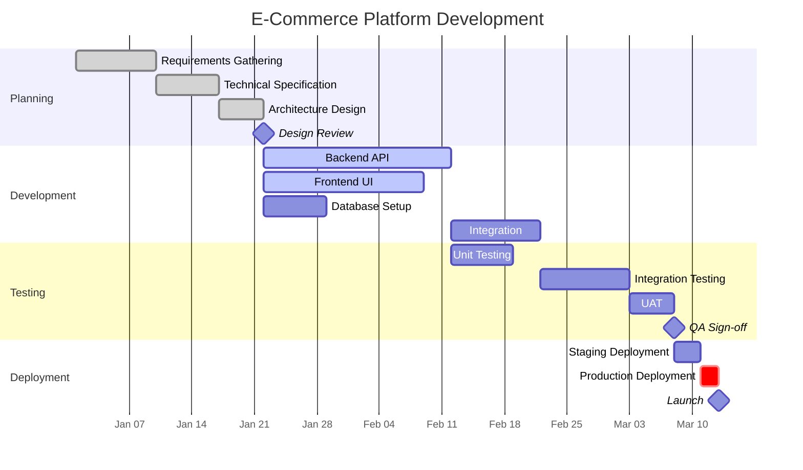

# Gantt Chart Rules & Standards for Mermaid JS

## Syntax
- First line MUST be `gantt`.
- Include a `title` on the second line.
- Define `dateFormat` on the third line (always use `YYYY-MM-DD`).
- Optionally set `axisFormat` for display formatting (e.g., `%b %d` for "Jan 15").

## Structure
```
gantt
    title Project Timeline
    dateFormat YYYY-MM-DD
    axisFormat %b %d

    section Section Name
    Task Name : taskId, startDate, endDate
    Task Name : taskId, after previousTaskId, duration
```

## Task Definition Formats
- **Explicit dates**: `Task : id1, 2024-01-01, 2024-01-15`
- **Duration-based**: `Task : id2, after id1, 14d`
- **Duration shorthand**: `7d` (7 days), `2w` (2 weeks), `1M` (not supported — use days)
- **Active task**: `Task : active, id3, 2024-01-01, 2024-01-15`
- **Done task**: `Task : done, id4, 2024-01-01, 2024-01-15`
- **Critical task**: `Task : crit, id5, 2024-01-01, 2024-01-15`
- **Milestone**: `Milestone Name : milestone, m1, 2024-02-01, 0d`

## Task Status Markers
- `done` — completed task (rendered lighter/grayed)
- `active` — currently in progress (highlighted)
- `crit` — critical path task (rendered in red)
- No marker — future/planned task (default rendering)
- Combine: `crit, done` — critical AND completed

## Dependencies
- `after id1` — start after task id1 finishes
- `after id1 id2` — start after BOTH id1 and id2 finish
- Dependencies create the logical flow of the project.

## Sections
- Use `section Name` to group related tasks.
- Each section gets its own visual grouping row.
- Section names should be short and descriptive (2-4 words).

## Best Practices
1. **ALWAYS USE dateFormat**: The `dateFormat YYYY-MM-DD` line is REQUIRED. Without it, dates will fail to parse.
2. **CONSISTENT DATE FORMAT**: ALL dates must match the `dateFormat`. If you set `YYYY-MM-DD`, use `2024-01-15` everywhere — never `01/15/2024` or `Jan 15`.
3. **TASK IDs ARE REQUIRED**: Every task MUST have a unique ID for dependency tracking. Use short camelCase IDs like `design1`, `devPhase`, `qaTest`.
4. **KEEP SECTIONS TO 3-5**: Too many sections clutter the chart. Group related work.
5. **LIMIT TASKS PER SECTION**: 3-6 tasks per section is ideal. More than 8 per section is hard to read.
6. **TOTAL TASKS**: Keep the entire chart to 10-25 tasks max for readability.
7. **USE DEPENDENCIES**: Always use `after prevTask` for sequential tasks. This creates a proper flow. Avoid manually setting exact dates for every task when they are sequential.
8. **REALISTIC DURATIONS**: Use realistic time estimates. A "Design" phase of `1d` is unrealistic. Use at least `5d` for major phases.
9. **MILESTONES**: Use milestones (`0d` duration) for key checkpoints like "Design Review", "Sprint Demo", "Launch Date".
10. **NO SPECIAL CHARACTERS IN IDS**: Task IDs must be alphanumeric with no spaces or special characters. `task_1` or `task1` — both work. `task-1` may cause issues.
11. **NO COLONS IN TASK NAMES**: Task names (the display text) must NOT contain colons. Colons are the delimiter. BAD: `Design: Phase 1 : d1, ...`. GOOD: `Design Phase 1 : d1, ...`.
12. **SECTION BEFORE TASKS**: Always declare a `section` before listing tasks belonging to it.

## Example


## Common Patterns
- **Waterfall**: Requirements → Design → Development → Testing → Deployment (sequential)
- **Agile Sprints**: Sprint 1 [2 weeks] → Sprint 2 [2 weeks] → Sprint 3 [2 weeks] (repeating sections)
- **Parallel Tracks**: Backend and Frontend running simultaneously, merging at Integration
- **Phased Rollout**: Alpha → Beta → GA releases with milestones

## Anti-Patterns to AVOID
- Having 30+ tasks (unreadable Gantt chart)
- Missing `dateFormat` line (causes parse failures)
- Using colons inside task names (breaks parser)
- Overlapping task IDs (each must be unique)
- Tasks with unrealistic 1-day durations for major work
- Forgetting section headers (tasks float without grouping)
