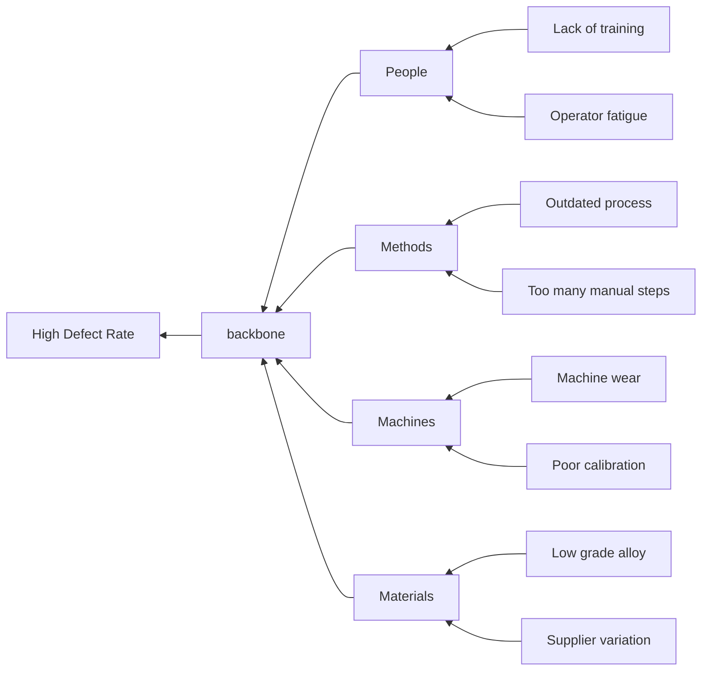

# Ishikawa (Fishbone) Diagram Rules & Standards for Mermaid JS

## Syntax
- Always start with `flowchart RL` (Right-to-Left layout matches fish head on right).
- Define primary categories as subgraphs or main backbone nodes.
- Secondary causes point to primary categories.

## Example

