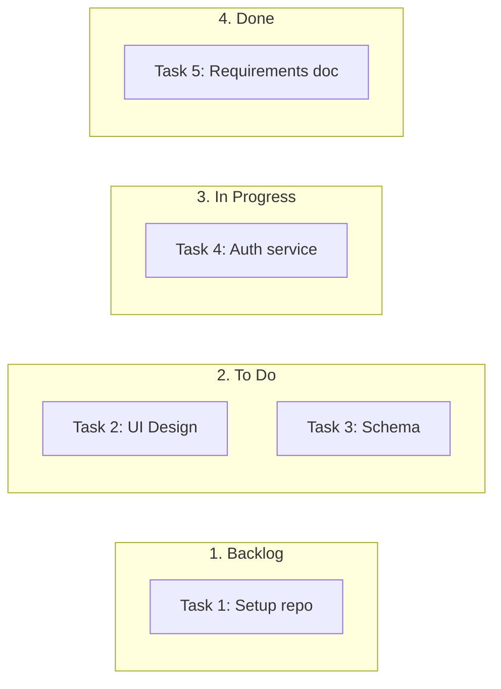

# Kanban Board Rules & Standards for Mermaid JS

## Syntax
- Always start with `flowchart LR`.
- Create subgraphs representing column lanes (Backlog, Todo, In Progress, Done).
- Nodes represent card details inside column subgraphs.

## Example

