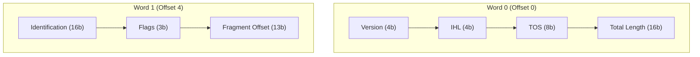

# Packet Diagram Rules & Standards for Mermaid JS

## Syntax
- Start with `flowchart TD` or `graph TD`.
- Represent offsets as subgraphs (e.g. "Bits 0 - 31").
- Create sequential fields linked left-to-right to show structure.

## Example

