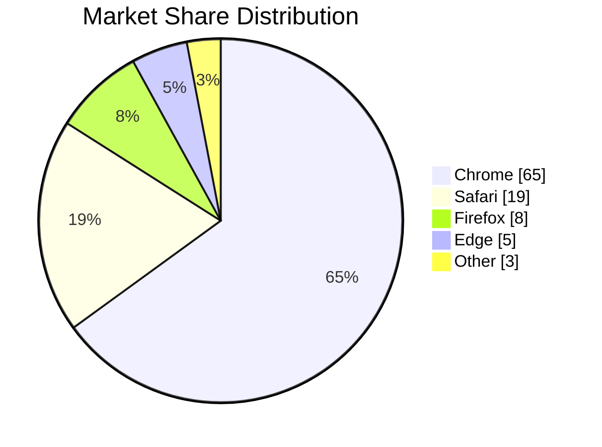
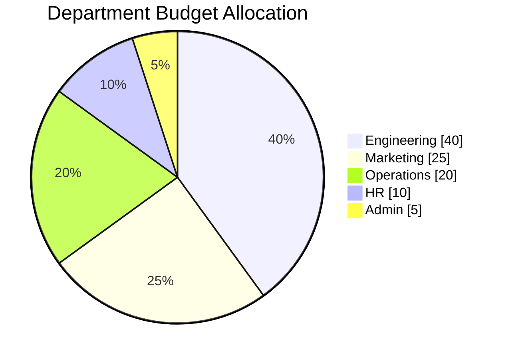
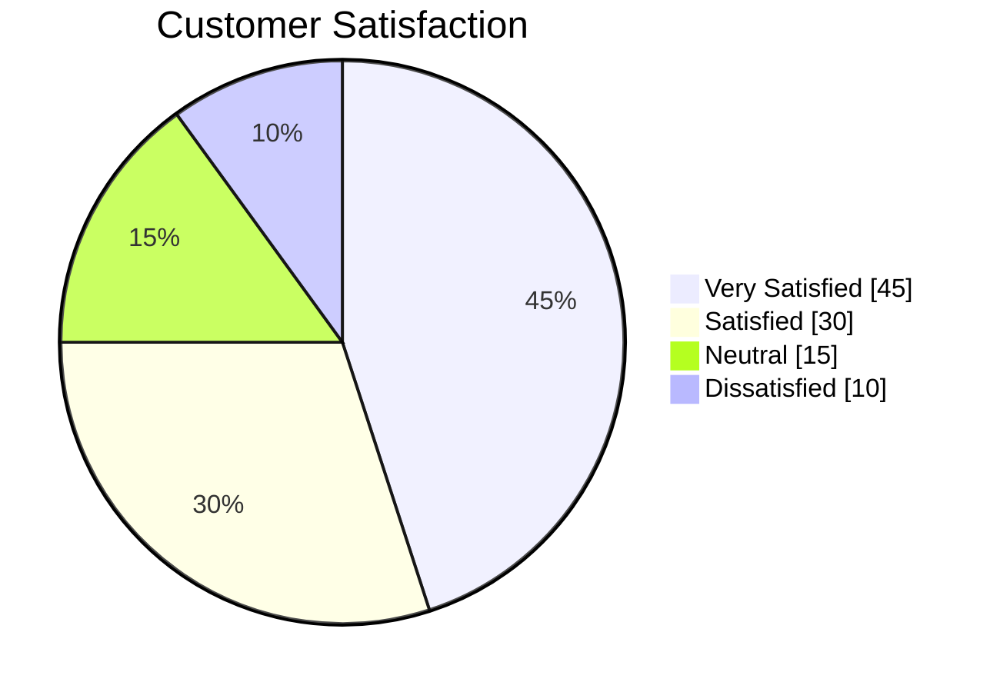

# Pie Chart Rules & Standards for Mermaid JS

## Syntax
- Always start with `pie` directive.
- Optionally add `showData` after `pie` to display percentage values.
- Use `title` for the chart title.
- Each slice is defined as `"Label" : value`

## Structure
```
pie showData
    title Chart Title
    "Category A" : 40
    "Category B" : 30
    "Category C" : 20
    "Category D" : 10
```

## Best Practices
1. Always include a `title` for context.
2. Use `showData` to display values/percentages on the chart.
3. Keep categories between 3-8 for readability.
4. Labels should be concise (max 3 words).
5. Values represent proportions — they don't need to sum to 100.
6. Mermaid automatically calculates percentages from the given values.
7. Order slices from largest to smallest for visual clarity.
8. Use descriptive labels that clearly identify each category.
9. Avoid too many small slices — group minor items as "Other".
10. Values must be positive numbers.

## Example - Basic


## Example - Budget


## Example - Survey


## Common Use Cases
- Market share breakdown
- Budget allocation
- Survey result proportions
- Resource distribution
- Traffic source analysis
- Team composition
- Revenue by product/region
