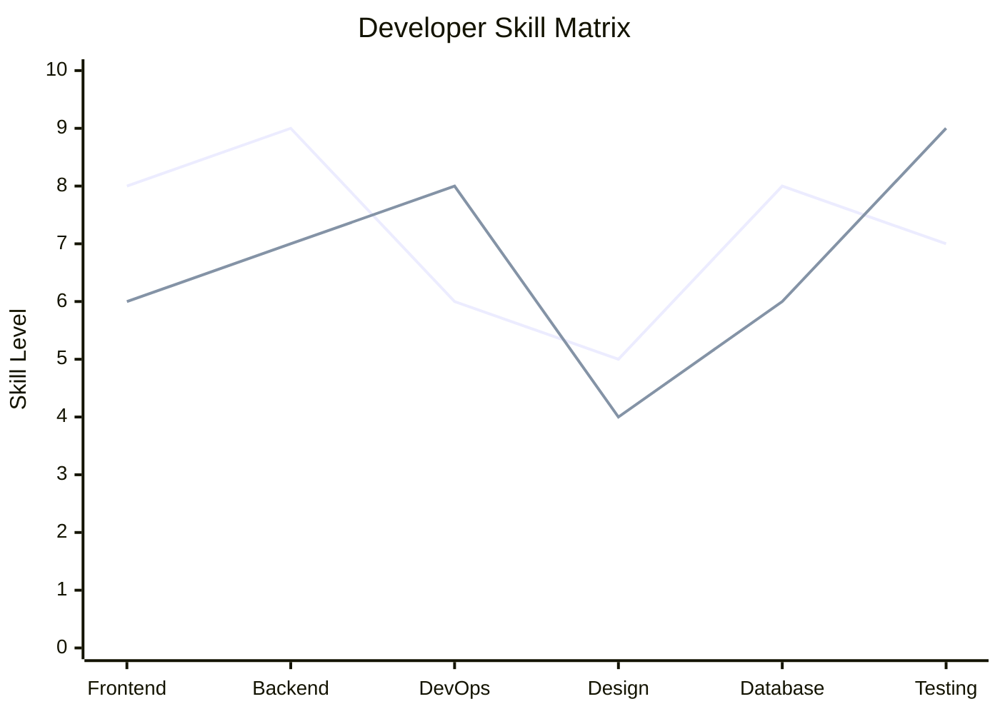

# Radar Chart Rules & Standards for Mermaid JS

## Syntax
- Represent Radar profiles using `xychart-beta`.
- Category labels on `x-axis` represent dimensions.
- `y-axis` represents values/ranges.

## Example

