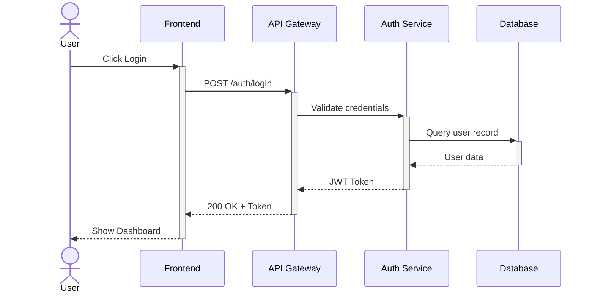

# Sequence Diagram Rules & Standards for Mermaid JS

## Syntax
- First line MUST be `sequenceDiagram`.
- Define participants with `participant` or `actor` keywords at the top.
- Use `participant` for systems/services (box shape).
- Use `actor` for human users (stick figure shape).

## Participant Declaration
- ALWAYS declare ALL participants at the top before any interactions.
- Use short aliases for readability: `participant FE as Frontend App`
- Participant ordering: declare them left-to-right in the order they first interact.
- **CRITICAL**: Participant aliases must be simple alphanumeric strings with NO special characters, NO spaces, and NO hyphens. Use camelCase or short abbreviations (e.g., `authSvc`, `userDB`).

## Arrow Standards
- `->>`  Solid arrow with arrowhead (synchronous request)
- `-->>` Dotted arrow with arrowhead (asynchronous response / callback)
- `->>`  Request direction: left-to-right
- `-->>` Response direction: right-to-left (back to caller)
- `->>+` Activate target lifeline (show processing)
- `-->>-` Deactivate target lifeline (processing complete)
- `-x`   Lost message / request failure (solid line with cross)
- `--x`  Response failure (dotted line with cross)
- `-)` 	 Async fire-and-forget
- `--))` Async response

## Activation (Lifelines)
- Use `activate` / `deactivate` or the `+` / `-` shorthand on arrows.
- Every `activate` MUST have a matching `deactivate`.
- **CRITICAL**: Every `->>+` (activate) on a participant MUST be matched by exactly one `-->>-` (deactivate) for that SAME participant BEFORE another activation of it.
- **NEVER** use `-->>-` (deactivate) on a participant that was not previously activated with `->>+`.
- **BRANCH / CONDITIONAL BALANCE**: If a participant is activated (`+`) inside an `alt`, `else`, `opt`, `loop`, or `par` block, it MUST be deactivated (`-`) *within that same block/path* before the block ends. Never leave activations open at the end of a block or the end of the diagram.
- **SIMPLE RULE**: If unsure about activation balance, do NOT use `+` or `-` markers at all — just use plain `->>` and `-->>` arrows. This always works and is much safer.
- Activations show the duration a participant is processing.
- Do NOT nest more than 2 levels of activation — it becomes unreadable.

## Grouping & Conditionals
- `alt` / `else` / `end` — if/else conditional branching
- `opt` / `end` — optional block (runs only if condition is true)
- `loop` / `end` — repeated interactions
- `par` / `and` / `end` — parallel execution
- `critical` / `option` / `end` — critical region with fallback
- `break` / `end` — break out of a sequence
- **CRITICAL**: Every `alt`, `opt`, `loop`, `par`, `critical`, `break` MUST have a matching `end`.
- **PARALLEL (par) BLOCK SYNTAX**: The title of a parallel block must be enclosed in square brackets.
  - BAD: `par Parallel processing`
  - GOOD: `par [Parallel processing]`
- **NESTING LIMITS**: Avoid nesting `alt` / `else` / `opt` blocks more than 2 levels deep, as it creates complex activation paths that often fail to render.

## Notes
- `Note right of Alice: Text` — note on the right side
- `Note left of Bob: Text` — note on the left side
- `Note over Alice,Bob: Text` — note spanning participants

## Best Practices
1. **LIMIT PARTICIPANTS**: Keep to 3-6 participants maximum. More than 6 makes the diagram too wide and hard to read.
2. **KEEP INTERACTIONS LINEAR**: Show the primary flow first, use `alt`/`opt` sparingly. Maximum 1-2 grouping blocks per diagram.
3. **CLEAR REQUEST-RESPONSE PAIRS**: Every request (`->>`) should have a corresponding response (`-->>`) unless it's fire-and-forget.
4. **NO SPECIAL CHARACTERS IN MESSAGES**: Arrow labels MUST NOT contain colons, semicolons, or angle brackets. Use plain English text only. BAD: `A->>B: GET /api/users: list`. GOOD: `A->>B: GET /api/users list`.
5. **DOUBLE-QUOTE MULTI-WORD MESSAGES ONLY IF NEEDED**: Simple messages don't need quotes. If the message contains special characters, wrap in quotes but avoid colons inside.
6. **ACTIVATION BALANCE**: Always balance activate/deactivate. Use the `+/-` shorthand for simplicity.
7. **READABILITY**: Keep message text short (under 40 chars). Use abbreviations for common actions.
8. **NUMBERING**: Do NOT number steps in messages (e.g., "1. Send request"). The sequence order is already implied by the diagram flow.
9. **AVOID SELF-CALLS OVERUSE**: Self-calls (`A->>A: process`) are fine sparingly but don't chain multiple self-calls in a row.

## Example


## Common Patterns
- **Request-Response**: Client → Server → DB → Server → Client
- **Auth Flow**: User → App → Auth → Token validation → Response
- **Webhook**: Service A → Service B → (async) Webhook callback → Service A
- **Pub-Sub**: Publisher → Broker → Subscriber1, Subscriber2

## Anti-Patterns to AVOID
- Having 10+ participants (unreadable)
- Deeply nested alt/opt/loop blocks (max 1 nesting level)
- Messages longer than 50 characters
- Using colons (`:`) inside message text after the first colon separator
- Forgetting to close grouping blocks with `end`

## Customization Capabilities in Sequence Diagrams
Here is a list of the customizations supported by Mermaid JS sequence diagrams:

1. **Node & Participant Customizations**:
   - **Shapes**:
     - `actor alias as Label`: Stick figure representation for human users.
     - `participant alias as Label`: Rectangle box for systems/microservices/databases.
   - **Grouping Boxes**:
     - Use `box "Group Title" ... end` to group participants inside a vertical background container.
     - Color grouping box: `box rgb(230, 240, 255) Group Title`.
       Example:
       ```mermaid
       box rgb(230, 240, 255) Frontend
           participant User
           participant App
       end
       ```

2. **Arrow & Line Customizations**:
   - **Arrowheads / Line Styles**:
     - `->>` (Synchronous solid arrow)
     - `-->>` (Asynchronous/callback dotted arrow)
     - `-x` (Lost request / error with cross marker)
     - `--x` (Lost response / error with cross marker)
     - `-)` (Async fire-and-forget message)
     - `--))` (Async response message)
   - **Arrow Colors**:
     - Individual lines/arrows *cannot* be styled using custom inline styling commands. They inherit colors from the global diagram theme.

3. **Background Highlights & Color Rectangles**:
   - **Highlight Regions**:
     - Use `rect rgb(R, G, B)` (or `rect rgba(...)`, `rect yellow`) followed by messages and `end` to draw a colored background rect over a group of interaction steps.
       Example:
       ```mermaid
       rect rgb(235, 255, 235)
           Client->>Server: Send payment
           Server-->>Client: Success confirmation
       end
       ```

4. **Themes & Directives**:
   - Set custom themes at the top of the diagram:
     - `%%{init: {'theme': 'dark'}}%%` (Supported values: `default`, `forest`, `dark`, `neutral`, `base`).

5. **Interactivity & Metadata**:
   - **Automatic Step Numbering**:
     - Add `autonumber` on the second line (just below `sequenceDiagram`) to automatically prefix step numbers (e.g. 1, 2, 3) to arrow messages.
   - **Links & Callbacks**:
     - `link ParticipantAlias: {"Label": "https://example.com"}` to add external links.
     - `click ParticipantAlias call callbackName()` for custom javascript execution when clicking a participant node.

---

# Mermaid Sequence Diagram Generation Rules

Based on all seven diagrams (the two Arka AI black-and-white diagrams and the Mermaid-generated colored diagrams), there is a very clear pattern in how the Mermaid generator constructs sequence diagrams. It follows a fairly deterministic template rather than making arbitrary design choices.

## 1. Participant Ordering

Always place participants horizontally from left to right in the order they first appear in the workflow.

Typical ordering:

```text
User / Customer
↓
Frontend / Mobile App
↓
Backend
↓
Internal Services
↓
Databases / Storage
↓
External Services
```

Examples:

```text
Customer
Frontend
Backend
Auth Service
Cart Service
Inventory Service
Payment Service
Payment Gateway
Order Service
Notification Service
```

or

```text
User
Frontend
Upload Service
Cloud Storage
Processing Service
Vector Database
Backend
LLM API
```

No participants overlap or change positions once declared.

---

## 2. Participant Types

Mermaid consistently models each major system as a separate participant.

Typical participant categories:

* Human actors
* Frontend/UI
* Backend/API
* Microservices
* Databases
* External APIs
* Background services

Example:

```text
User
Frontend
Backend
Database
Notification Service
```

---

## 3. Participant Styling

Mermaid automatically colors participants.

Observed color palette:

| Type                  | Color              |
| --------------------- | ------------------ |
| Human Actor           | Purple / Pink      |
| Frontend              | Cyan / Teal        |
| Backend               | Orange             |
| Business Services     | Blue / Green       |
| Databases             | Light Blue         |
| External APIs         | Yellow             |
| Notification Services | Light Green        |
| Payment Services      | Light Red / Purple |

The colors remain consistent within a single diagram.

It appears Mermaid cycles through a predefined pastel palette rather than assigning semantic colors.

---

## 4. Lifelines

Every participant gets

* top participant box
* vertical lifeline
* bottom participant box

Like:

```text
┌──────────┐
│ Backend  │
└──────────┘
     │
     │
     │
┌──────────┐
│ Backend  │
└──────────┘
```

---

## 5. Messages

Requests use solid arrows.

```text
Frontend ─────────► Backend
```

Responses use dotted arrows.

```text
Backend - - - - -► Frontend
```

This convention is followed consistently.

---

## 6. Self Calls

Internal work is modeled using self messages.

Example:

```text
Backend
   │
   │─────┐
   │     │ Validate User
   └─────┘
```

Seen for

* Generate Token
* Validate User
* Extract Text
* Rider Picks Up
* Rider Delivers

---

## 7. Control Structures

Mermaid uses UML combined fragments.

### alt

Alternative paths

```text
alt User Found

...

else User Not Found

...
```

Examples:

* Login success/failure
* Token valid/expired
* Payment success/failure
* Restaurant accepts/rejects

---

### loop

Repeated behavior

Examples:

```text
loop Retry 3 Times
```

```text
loop GPS Updates
```

```text
loop Driver Search
```

---

### par

Parallel execution

Used for concurrent workflows.

Example:

```text
par

Payment Processing

and

Rider Search
```

---

### opt

Optional behavior

Seen for

```text
opt

Order Confirmed

...
```

---

## 8. Arrow Labels

Every arrow has an action.

Examples

```text
Request Ride

Upload PDF

Validate User

Create Payment Session

Store File

Retrieve Chunks

Generate Embeddings

Update Inventory
```

No unlabeled arrows.

---

## 9. Response Labels

Return messages include

```text
Payment Verified

Driver Details

User Found

Email Sent

Processing Complete

200 Success

404 Error
```

Usually on dashed arrows.

---

## 10. External APIs

External systems are modeled exactly like services.

Examples

```text
Payment Gateway

LLM API

Notification Service
```

No special icons.

---

## 11. Databases

Databases are participants rather than database symbols.

Examples

```text
Database

Cloud Storage

Vector Database
```

---

## 12. Error Handling

Errors always appear inside

```text
alt
```

blocks.

Examples

```text
Payment Failed

Retry

Token Expired

Driver Not Found

Timeout

LLM Failure
```

---

## 13. Retry Logic

Retries are represented using

```text
loop
```

or repeated request arrows.

Example

```text
Attempt 1

Timeout

Attempt 2

Timeout

Attempt 3

Success
```

---

## 14. Background Processes

Background processing is shown as messages.

Example

```text
Upload Service

↓

Cloud Storage

↓

Processing Service

↓

Vector Database
```

instead of using notes.

---

## 15. Message Ordering

Everything follows time.

Top

↓

Bottom

No upward arrows.

---

## 16. Activation Bars

Mermaid adds thin colored activation rectangles automatically when a participant is actively processing a message.

Observed colors generally match the participant's assigned pastel color.

---

## 17. Diagram Layout

Participants

↓

Messages

↓

Combined Fragments

↓

Responses

↓

End

Always vertically chronological.

---

## 18. Combined Fragment Placement

Mermaid wraps only the relevant section.

Example

```text
alt

Payment Success

...

else

Payment Failed

...
```

rather than surrounding the entire diagram.

---

## 19. Notes / Highlights

Special annotations (like **"Timeout"**, **"Email with reset link"**, or **"Flow returns to password reset request"**) are rendered as colored note boxes adjacent to the relevant participant or message.

---

## 20. Naming Convention

Participants use concise Title Case names.

Examples

```text
Backend

Frontend

Order Service

Auth Service

Vector Database

LLM API
```

Messages use verb phrases.

Examples

```text
Validate User

Store File

Retrieve Chunks

Generate Embeddings

Send Receipt

Display Success Message
```

---

# Overall Mermaid Style Guide

The generator consistently follows these high-level design principles:

* **One participant per system/component**, declared once and kept in a fixed left-to-right order.
* **Pastel-colored participant headers** with matching activation bars; actors typically use purple/pink, frontend cyan, backend orange, services blue/green, databases light blue, and external APIs yellow/red.
* **Solid arrows for requests**, **dashed arrows for responses/returns**.
* **Self-messages** for internal processing within a participant.
* **UML combined fragments** (`alt`, `loop`, `par`, `opt`) to represent branching, retries, concurrency, and optional flows.
* **Chronological top-to-bottom execution** with no upward message flow.
* **Clear verb-based message labels** and concise participant names.
* **Activation bars** appear only while a participant is executing work.
* **Optional notes/highlights** for exceptional events such as timeouts or emailed links.
* **Minimal visual clutter**: no icons beyond actors, no custom shapes, and no crossing lifelines.
