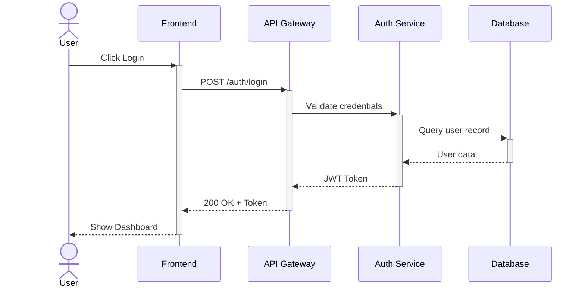

# Sequence Diagram Rules & Standards for Mermaid JS

## Syntax
- First line MUST be `sequenceDiagram`.
- Define participants with `participant` or `actor` keywords at the top.
- Use `participant` for systems/services (box shape).
- Use `actor` for human users (stick figure shape).

## Participant Declaration
- ALWAYS declare ALL participants at the top before any interactions.
- Use short aliases for readability: `participant FE as Frontend App`
- Participant ordering: declare them left-to-right in the order they first interact.
- **CRITICAL**: Participant aliases must be simple alphanumeric strings with NO special characters, NO spaces, and NO hyphens. Use camelCase or short abbreviations (e.g., `authSvc`, `userDB`).

## Arrow Standards
- `->>`  Solid arrow with arrowhead (synchronous request)
- `-->>` Dotted arrow with arrowhead (asynchronous response / callback)
- `->>`  Request direction: left-to-right
- `-->>` Response direction: right-to-left (back to caller)
- `->>+` Activate target lifeline (show processing)
- `-->>-` Deactivate target lifeline (processing complete)
- `-x`   Lost message / error
- `-)` 	 Async fire-and-forget

## Activation (Lifelines)
- Use `activate` / `deactivate` or the `+` / `-` shorthand on arrows.
- Every `activate` MUST have a matching `deactivate`.
- **CRITICAL**: Every `->>+` (activate) on a participant MUST be matched by exactly one `-->>-` (deactivate) for that SAME participant BEFORE another activation of it.
- **NEVER** use `-->>-` (deactivate) on a participant that was not previously activated with `->>+`.
- **SIMPLE RULE**: If unsure about activation balance, do NOT use `+` or `-` markers at all — just use plain `->>` and `-->>` arrows. This always works.
- Activations show the duration a participant is processing.
- Do NOT nest more than 2 levels of activation — it becomes unreadable.

## Grouping Constructs
- `alt` / `else` / `end` — if/else conditional branching
- `opt` / `end` — optional block (runs only if condition is true)
- `loop` / `end` — repeated interactions
- `par` / `and` / `end` — parallel execution
- `critical` / `option` / `end` — critical region with fallback
- `break` / `end` — break out of a sequence
- **CRITICAL**: Every `alt`, `opt`, `loop`, `par`, `critical`, `break` MUST have a matching `end`.

## Notes
- `Note right of Alice: Text` — note on the right side
- `Note left of Bob: Text` — note on the left side
- `Note over Alice,Bob: Text` — note spanning participants

## Best Practices
1. **LIMIT PARTICIPANTS**: Keep to 3-6 participants maximum. More than 6 makes the diagram too wide and hard to read.
2. **KEEP INTERACTIONS LINEAR**: Show the primary flow first, use `alt`/`opt` sparingly. Maximum 1-2 grouping blocks per diagram.
3. **CLEAR REQUEST-RESPONSE PAIRS**: Every request (`->>`) should have a corresponding response (`-->>`) unless it's fire-and-forget.
4. **NO SPECIAL CHARACTERS IN MESSAGES**: Arrow labels MUST NOT contain colons, semicolons, or angle brackets. Use plain English text only. BAD: `A->>B: GET /api/users: list`. GOOD: `A->>B: GET /api/users list`.
5. **DOUBLE-QUOTE MULTI-WORD MESSAGES ONLY IF NEEDED**: Simple messages don't need quotes. If the message contains special characters, wrap in quotes but avoid colons inside.
6. **ACTIVATION BALANCE**: Always balance activate/deactivate. Use the `+/-` shorthand for simplicity.
7. **READABILITY**: Keep message text short (under 40 chars). Use abbreviations for common actions.
8. **NUMBERING**: Do NOT number steps in messages (e.g., "1. Send request"). The sequence order is already implied by the diagram flow.
9. **AVOID SELF-CALLS OVERUSE**: Self-calls (`A->>A: process`) are fine sparingly but don't chain multiple self-calls in a row.

## Example

## Common Patterns
- **Request-Response**: Client → Server → DB → Server → Client
- **Auth Flow**: User → App → Auth → Token validation → Response
- **Webhook**: Service A → Service B → (async) Webhook callback → Service A
- **Pub-Sub**: Publisher → Broker → Subscriber1, Subscriber2

## Anti-Patterns to AVOID
- Having 10+ participants (unreadable)
- Deeply nested alt/opt/loop blocks (max 1 nesting level)
- Messages longer than 50 characters
- Using colons (`:`) inside message text after the first colon separator
- Forgetting to close grouping blocks with `end`
