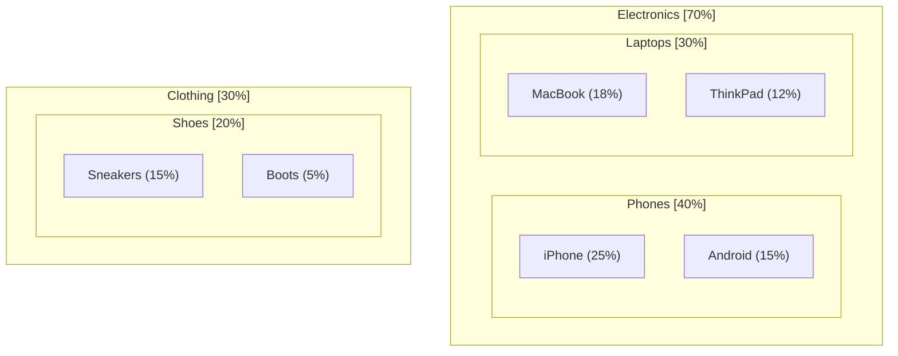

# Treemap Diagram Rules & Standards for Mermaid JS

## Syntax
- Always start with `flowchart TD` or `flowchart LR`.
- Use nested subgraphs representing parent categories.
- Leaves are individual nodes with custom style classes.

## Example

