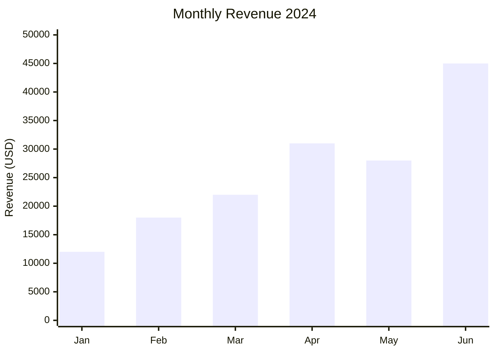
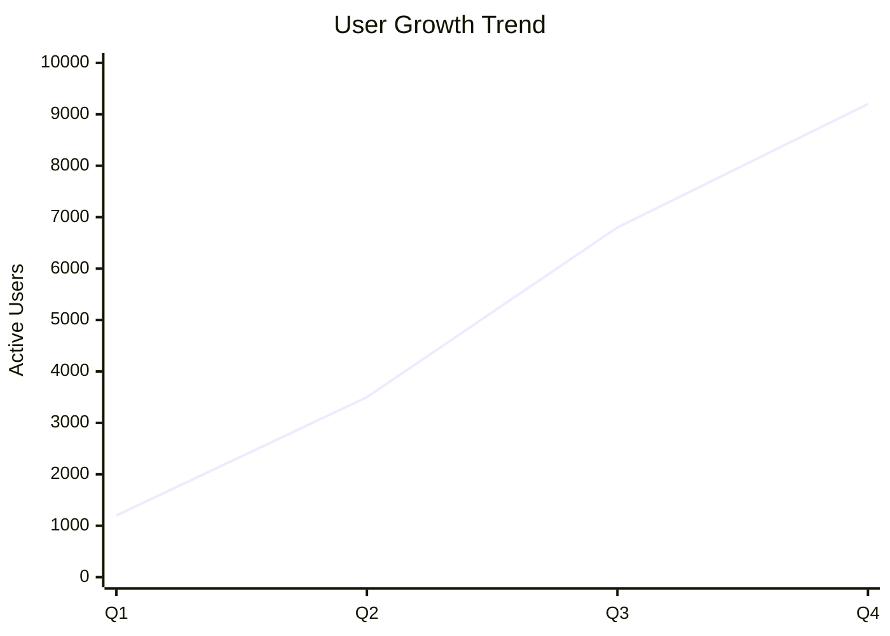
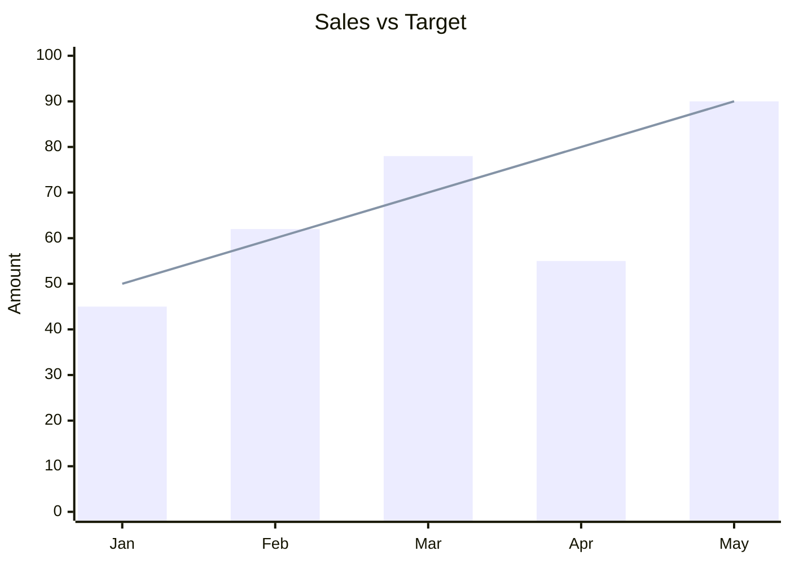

# XY Chart Rules & Standards for Mermaid JS

## Syntax
- Always start with `xychart-beta` directive.
- Define title, x-axis, y-axis, then data series.

## Structure
```
xychart-beta
    title "Chart Title"
    x-axis [label1, label2, label3, ...]
    y-axis "Y Axis Label" min_value --> max_value
    bar [value1, value2, value3, ...]
    line [value1, value2, value3, ...]
```

## Chart Types
- **Bar Chart**: Use `bar [values]` for categorical comparison
- **Line Chart**: Use `line [values]` for trend/time series data
- **Combined**: Use both `bar` and `line` together for composite charts

## Best Practices
1. Always include a descriptive title using `title "..."`.
2. X-axis labels should be concise (max 3 words each).
3. Keep x-axis categories between 4-12 for readability.
4. Y-axis should have a clear label describing the unit.
5. Use `y-axis "Label" min --> max` to set explicit range.
6. Numbers should be realistic and proportional.
7. When showing trends over time, use line charts.
8. When comparing categories, use bar charts.
9. For showing both trend and comparison, combine bar + line.
10. Always ensure values are comma-separated inside brackets.

## Example - Bar Chart


## Example - Line Chart


## Example - Combined


## Common Use Cases
- Revenue/Sales tracking over months
- Performance metrics comparison
- Survey results visualization
- Resource utilization over time
- Budget vs Actual spending
