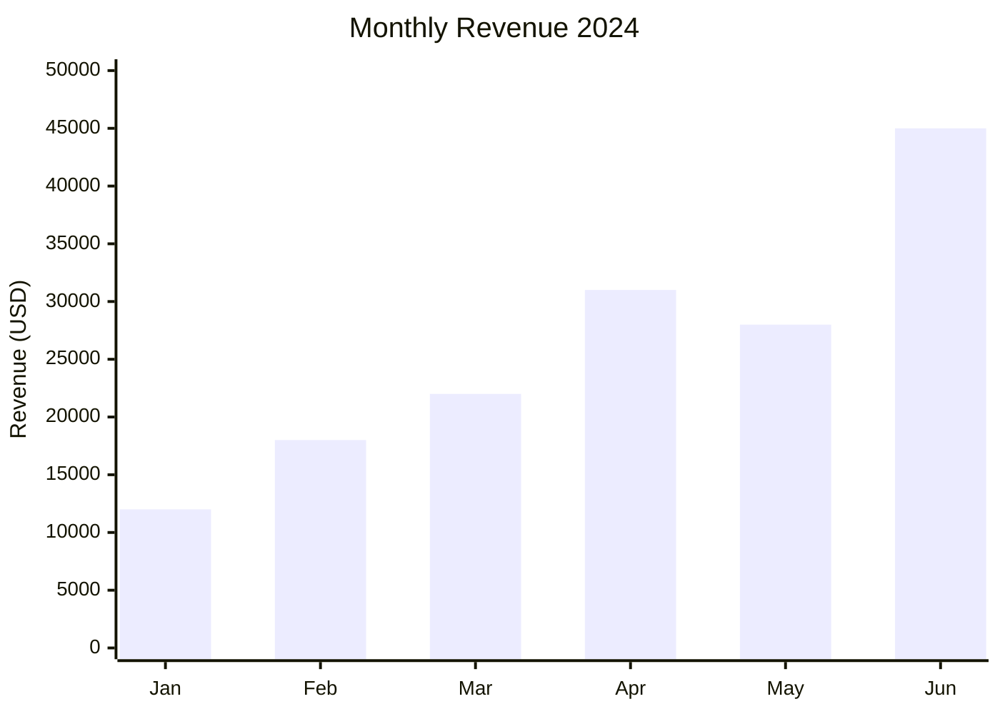
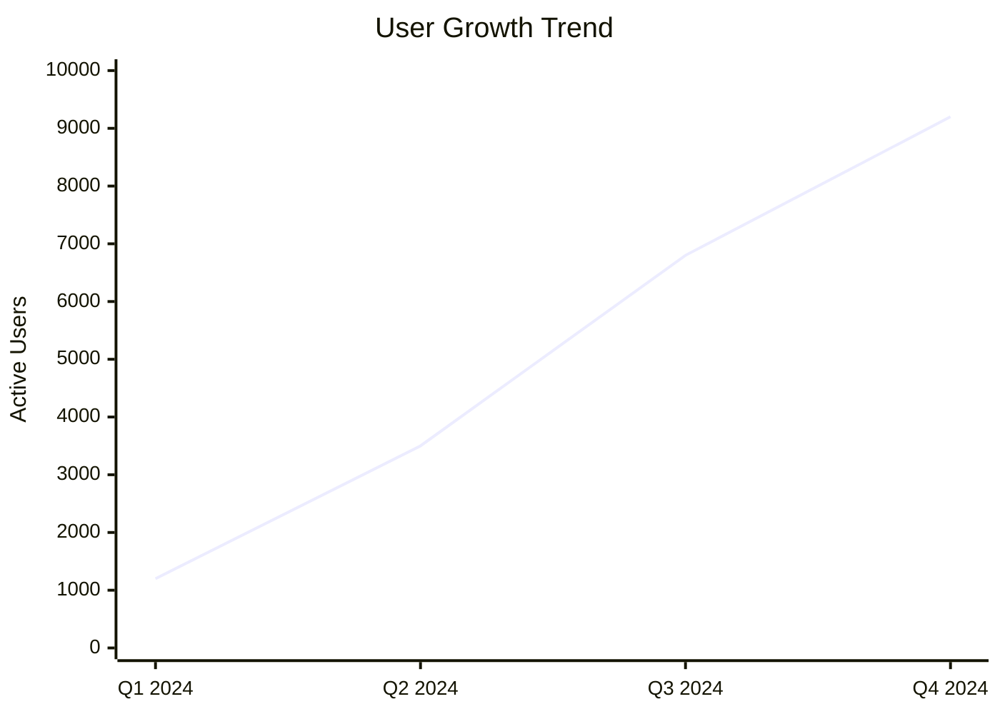
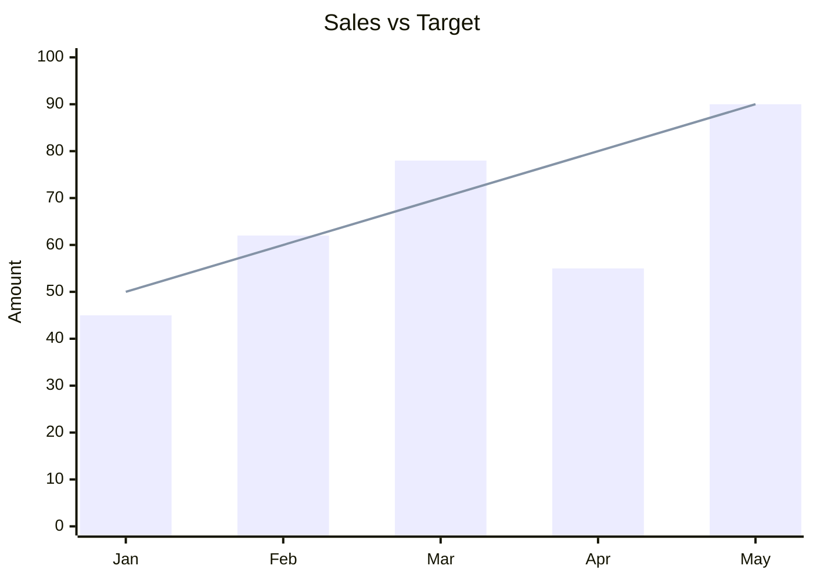

# XY Chart Rules & Standards for Mermaid JS

## Syntax
- Always start with `xychart-beta` directive.
- Define title, x-axis, y-axis, then data series.
- Keep the syntax extremely simple.

## Structure
```mermaid
xychart-beta
    title "Chart Title"
    x-axis [label1, label2, label3, ...]
    y-axis "Y Axis Label" min_value --> max_value
    bar [value1, value2, value3, ...]
    line [value1, value2, value3, ...]
```

## Chart Types
- **Bar Chart**: Use `bar [values]` for categorical comparison.
- **Line Chart**: Use `line [values]` for trend/time series data.
- **Combined**: Use both `bar` and `line` together for composite charts.

## Directives
- `title "..."` — Set the overall chart title (always wrap in double quotes).
- `x-axis [...]` — Set labels for categories.
  - Category list must be wrapped in square brackets.
  - Individual labels can be plain text, but MUST be quoted in double quotes if they contain spaces or special characters.
    - GOOD: `x-axis [Jan, Feb, Mar]`
    - ALSO GOOD: `x-axis ["Q1 2024", "Q2 2024", "Q3 2024"]`
    - BAD: `x-axis [Q1 2024, Q2 2024]` (spaces break parsing)
- `y-axis "Label" min --> max` — Define y-axis title and numeric bounds.
  - The label must be wrapped in double quotes.
  - Min and max values are numeric bounds (e.g. `0 --> 50000` or `1.5 --> 10.0`).
- `bar [...]` — Render values as bar heights.
- `line [...]` — Render values as line points.

## Best Practices
1. **ALWAYS USE xychart-beta**: The first line must be exactly `xychart-beta`.
2. **ALWAYS QUOTE TITLES AND LABELS**: The chart title and y-axis label must be enclosed in double quotes.
3. **NO SPACES IN BARE X-AXIS LABELS**: If x-axis labels contain spaces (e.g. "Semester 1"), wrap each label in double quotes inside the brackets.
4. **MATCH DATA POINTS TO X-AXIS CATEGORIES**: The number of data values in your `bar` or `line` array must exactly match the number of labels defined in your `x-axis` array.
5. **SCALE APPROPRIATELY**: If combining `bar` and `line` series, ensure they represent metrics that share the same scale. Mermaid `xychart-beta` does not support dual-axis scaling.
6. **LIMIT CATEGORIES**: Keep the number of categories on the x-axis between 4 and 12 for readability.
7. **USE REAL NUMBERS**: Data values must be numeric (integers or floating-point decimals). Do not include currency symbols ($) or percent signs (%) inside the data arrays.

## CRITICAL Anti-Patterns — NEVER DO THESE

### 1. NEVER Put Labels Directly after Series Statements
Mermaid `xychart-beta` does not support inline labeling of lines or bars. Any text after the data array will cause a rendering failure.
- **WRONG**:
```
line [12, 15, 18] "Mathematics"
bar [30, 45, 60] "Sales"
```
- **CORRECT**:
```
line [12, 15, 18]
bar [30, 45, 60]
```

### 2. NEVER Use the `legend` Directive
There is no `legend` statement in the `xychart-beta` syntax. Mermaid does not support declaring legends in the diagram markup.
- **WRONG**:
```
legend ["Mathematics", "Science"]
legend [Sales, Revenue]
```
- **CORRECT** (Omit the legend line completely):
```
xychart-beta
    title "Math vs Science Scores"
    x-axis [Sem1, Sem2, Sem3]
    y-axis "Marks" 0 --> 100
    line [72, 75, 78]
    line [70, 73, 77]
```

### 3. NEVER Use the `annotate` Directive
Annotating individual points or ranges using `annotate` is not supported in `xychart-beta`.
- **WRONG**:
```
annotate "Peak: $142" 11 142
annotate "Oversold" 2 108
```
- **CORRECT** (Incorporate annotations or callouts in the description or chart title instead).

### 4. NEVER Use the `grid` Directive
The gridlines configuration cannot be set using a `grid` statement in the markup.
- **WRONG**:
```
grid true
grid false
```
- **CORRECT** (Grid display is determined by the application theme, not the markup).

### 5. NEVER Mix Mismatched Scales
Since there is only one y-axis scale, do not plot data series with vastly different scales (e.g. plotting visitors in thousands and conversion rate as a small decimal percentage) on the same chart.
- **WRONG** (Conversion rate of 4.5% will be a flat line at the bottom of a 0-40000 axis):
```
y-axis "Visitors" 0 --> 40000
line [15000, 21000, 36000]
bar [2.8, 3.3, 4.5]
```
- **CORRECT** (Separate into two different charts or scale the metrics proportionally if combined).

## Example — Bar Chart


## Example — Line Chart


## Example — Combined

